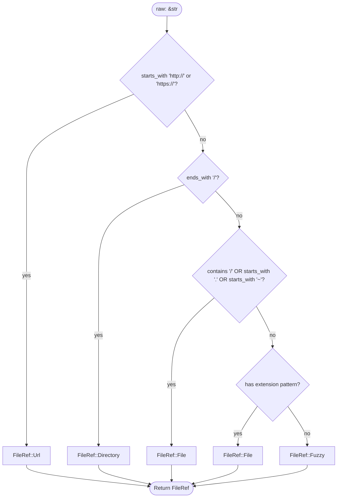

# classify_ref Function

**Type:** technology

### From: parse

The `classify_ref` function implements the semantic analysis phase of reference parsing, transforming raw text strings into typed `FileRef` variants according to a carefully ordered set of classification rules. As a private helper function, it encapsulates the heuristics that distinguish URLs from filesystem paths, directories from files, and explicit paths from fuzzy names. The function's implementation reflects domain-specific knowledge about how users naturally express file references in command-line and chat interfaces, prioritizing unambiguous patterns while providing sensible fallbacks for ambiguous cases.

The classification hierarchy follows decreasing specificity: URL detection uses prefix matching on `http://` and `https://` schemes, catching web resources before they can be misinterpreted as local paths. Directory classification relies on the trailing slash convention common in Unix-like systems and URL paths, stripping the suffix before constructing the `PathBuf`. File path detection employs multiple signals: presence of path separators (`/`), leading dots (for relative paths like `./config` or `../parent`), leading tildes (for home directory expansion `~/`), or filename extension patterns. The extension detection uses `rsplitn` to handle multi-part extensions correctly, with heuristics to exclude hidden files starting with dot.

The fuzzy name fallback captures the remaining cases—bare identifiers like `Cargo`, `main`, or `README` that users expect to match against project files through intelligent search rather than exact path resolution. This design acknowledges that strict path requirements would create friction in conversational interfaces. The function's use of `PathBuf::from` rather than path canonicalization preserves user intent and allows downstream components to apply appropriate path resolution strategies (relative to working directory, project root, or through search paths).

## Diagram

## External Resources

- [Rust PathBuf for platform-independent path handling](https://doc.rust-lang.org/std/path/struct.PathBuf.html) - Rust PathBuf for platform-independent path handling
- [Wikipedia on heuristic algorithms in computer science](https://en.wikipedia.org/wiki/Heuristic) - Wikipedia on heuristic algorithms in computer science

## Sources

- [parse](../sources/parse.md)
