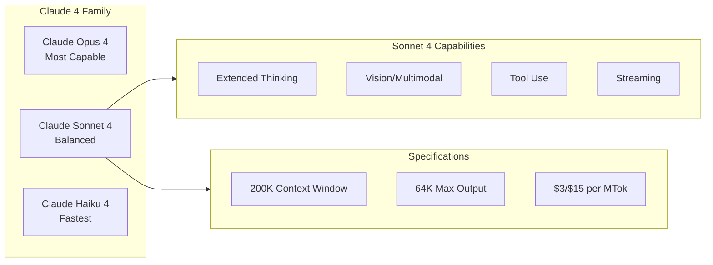

# Claude Sonnet 4

**Type:** product

### From: anthropic

Claude Sonnet 4 is a large language model from Anthropic's Claude family, positioned as the balanced performance tier between the more capable Opus models and the faster Haiku variants. Released in 2025 (as indicated by the version date 20250514 in the code), Sonnet 4 represents a significant advancement in Anthropic's model lineup with particular emphasis on reasoning capabilities and extended thinking features. The model supports a massive 200,000 token context window and can generate up to 64,000 tokens in a single response, making it suitable for long-document analysis, complex multi-step reasoning, and substantial code generation tasks. With pricing at $3.00 per million input tokens and $15.00 per million output tokens, it occupies a middle tier in terms of cost-performance ratio within the Claude ecosystem.

As documented in this implementation, Claude Sonnet 4 includes several advanced capabilities that distinguish it from earlier generations. The model supports streaming responses for real-time applications, native vision capabilities for image understanding via base64-encoded inputs, and sophisticated tool use with streaming JSON argument parsing. Most notably, it includes support for extended thinking mode, which allows the model to perform explicit reasoning steps that can be observed and controlled by the application. This feature, accessed through the `thinking` and `thinking_budget_tokens` options in the API, enables use cases requiring transparent reasoning such as complex problem solving, detailed analysis, and educational applications where showing work is important.

The model's architecture and training reflect Anthropic's focus on helpfulness, harmlessness, and honesty, with particular attention to reducing hallucinations and providing nuanced, well-reasoned responses. The implementation details in this Rust code reveal how applications can leverage Sonnet 4's capabilities through careful construction of message payloads with support for multi-modal content, tool definitions with JSON schemas, and dynamic control over thinking budgets. The model id format `claude-sonnet-4-20250514` follows Anthropic's versioning convention that includes model family, generation, and release date, enabling precise targeting of specific model snapshots for reproducibility. Sonnet 4's balance of capability, speed, and cost makes it suitable for a wide range of production applications from customer service automation to software development assistance.

## Diagram

## External Resources

- [Claude model overview and capability comparisons](https://docs.anthropic.com/en/docs/about-claude/models) - Claude model overview and capability comparisons
- [Anthropic API pricing for all Claude models](https://www.anthropic.com/pricing) - Anthropic API pricing for all Claude models

## Sources

- [anthropic](../sources/anthropic.md)
