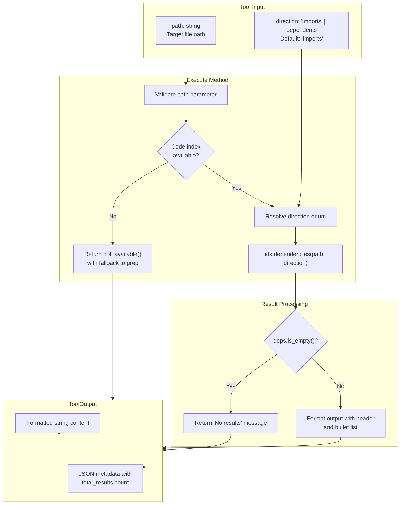

# CodeIndexDependenciesTool

**Type:** technology

### From: codeindex_dependencies

CodeIndexDependenciesTool is a specialized implementation of the Tool trait within the Ragent agent framework, designed to query file-level dependency relationships from a pre-computed code index. This tool represents a significant advancement over traditional text-search approaches for understanding code structure, as it operates on semantically meaningful dependency edges rather than approximate pattern matches. The tool's architecture follows a clean separation of concerns: it accepts structured JSON input through a well-defined schema, validates parameters, delegates actual dependency resolution to an underlying CodeIndex abstraction, and returns formatted output with metadata for downstream processing. The implementation leverages Rust's type system and async ecosystem, using the `async-trait` crate to define asynchronous tool execution within a trait-based framework. A particularly notable aspect of this tool is its graceful degradation strategy—when the code index is unavailable (either disabled or uninitialized), it returns a structured error response that includes fallback tool recommendations, specifically suggesting `grep` as an alternative for manual import statement searches. This design demonstrates production-ready engineering that anticipates operational conditions and provides actionable guidance to agent systems.

The tool supports bidirectional dependency queries through its `direction` parameter, which can be set to either 'imports' (retrieving what a given file depends on) or 'dependents' (retrieving what other files depend on the given file). This bidirectional capability is essential for two common software engineering tasks: understanding the dependencies of a file to comprehend its requirements and constraints, and performing impact analysis to determine what might break when modifying a file. The implementation uses the `ragent_code::types::DepDirection` enum to represent these directions internally, with a default value of 'imports' that reflects the more common use case. The tool's output is carefully formatted for human readability while preserving structured metadata, presenting results as a bulleted list with clear headers indicating the query direction and target file. Empty result sets are handled explicitly with informative messages rather than silent returns, ensuring that agent systems and human operators understand when no dependencies exist versus when queries might have failed.

From a security and permissions perspective, the tool declares itself under the 'codeindex:read' permission category, indicating that it performs read-only operations against the code index without modifying any source files or index state. This granular permission categorization enables sophisticated access control policies in multi-agent or multi-tenant deployments. The tool's integration with the broader Ragent ecosystem is evident in its use of shared types like `ToolContext`, which provides access to agent-wide resources including the optional code index, and `ToolOutput`, which standardizes the return format across all tools. The JSON schema for parameters enforces strict validation through `additionalProperties: false`, preventing malformed requests and ensuring predictable behavior. Overall, CodeIndexDependenciesTool exemplifies how modern agent frameworks can encapsulate complex static analysis capabilities behind simple, well-documented interfaces that enable AI systems to reason about code architecture at a level of abstraction that matches human software engineering intuition.

## Diagram

## External Resources

- [async-trait crate documentation - enables async methods in traits for Rust](https://docs.rs/async-trait/latest/async_trait/) - async-trait crate documentation - enables async methods in traits for Rust
- [JSON Schema specification - used for parameter validation in the tool](https://json-schema.org/) - JSON Schema specification - used for parameter validation in the tool
- [Rust trait objects and polymorphism patterns used in the Tool trait implementation](https://doc.rust-lang.org/book/ch17-00-oop.html) - Rust trait objects and polymorphism patterns used in the Tool trait implementation

## Sources

- [codeindex_dependencies](../sources/codeindex-dependencies.md)
