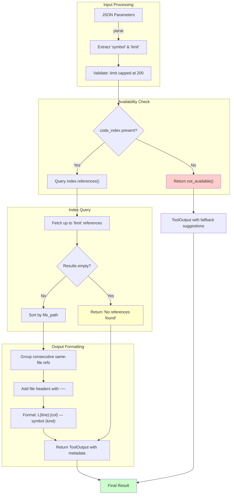

# CodeIndexReferencesTool

**Type:** technology

### From: codeindex_references

The `CodeIndexReferencesTool` is a Rust struct that implements semantic symbol reference lookup for AI-powered development tools. This technology bridges the gap between simple text search and language-aware code navigation by providing structured access to a pre-computed code index. Unlike traditional `grep`-based approaches that match strings regardless of context, this tool understands that a function named `parse` in one module is distinct from a `parse` method in another, and can distinguish between a type being declared, a function being called, or a field being accessed. The tool was designed with fallback mechanisms in mind, recognizing that sophisticated language services may not always be available—perhaps due to resource constraints, project configuration, or initialization timing. When the code index is unavailable, it provides clear guidance to use `lsp_references` for IDE-like precision or `grep` for basic text matching. The implementation leverages Rust's async ecosystem through the `async-trait` crate, allowing non-blocking execution of potentially expensive index queries. Output formatting demonstrates careful attention to user experience, with results grouped by file and annotated with line numbers, column positions, and reference kinds in a visually structured format using Unicode box-drawing characters.

## Diagram

## External Resources

- [async-trait crate documentation for ergonomic async methods in traits](https://docs.rs/async-trait/latest/async_trait/) - async-trait crate documentation for ergonomic async methods in traits
- [Language Server Protocol specification that inspired semantic reference features](https://microsoft.github.io/language-server-protocol/) - Language Server Protocol specification that inspired semantic reference features
- [serde_json crate for JSON serialization used in parameter schemas and metadata](https://crates.io/crates/serde_json) - serde_json crate for JSON serialization used in parameter schemas and metadata

## Sources

- [codeindex_references](../sources/codeindex-references.md)
