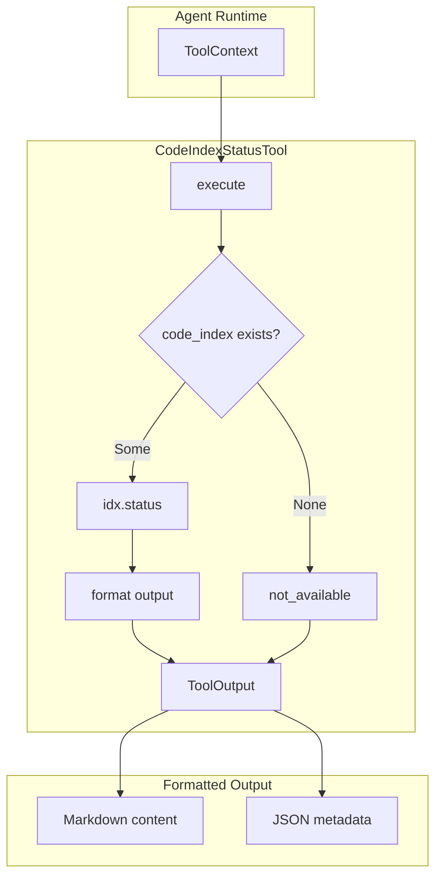

# CodeIndexStatusTool

**Type:** technology

### From: codeindex_status

CodeIndexStatusTool is a specialized diagnostic component within the ragent-core agent framework, implemented as a Rust struct that provides comprehensive reporting capabilities for codebase index state. The tool serves a dual purpose: delivering human-readable formatted reports for direct user interaction and structured machine-readable metadata for programmatic consumption by other agent components. Its architecture reflects careful consideration of the operational realities of large-scale code indexing, where indices may be temporarily unavailable due to initialization overhead, resource constraints, or explicit disablement.

The tool's implementation leverages Rust's type system and the async_trait crate to integrate with the framework's Tool trait, establishing a contract that includes name identification, description generation, JSON Schema parameter validation, permission categorization, and asynchronous execution. This standardized interface enables the broader agent system to discover, validate, and invoke the tool without tight coupling to its internal implementation. The permission category "codeindex:read" demonstrates security-conscious design, allowing administrators to configure access policies that prevent unauthorized inspection of potentially sensitive codebase metadata.

When executed, CodeIndexStatusTool performs a sophisticated multi-stage data aggregation from the underlying index statistics. It collects quantitative metrics including file coverage counts, total symbol extraction volume, and storage utilization in both raw bytes and human-friendly kilobyte representations. Beyond raw numbers, it analyzes language distribution across the indexed codebase, presenting frequency counts that reveal the polyglot nature of modern software projects. Temporal operational data including timestamps of last full and incremental indexing operations provides crucial context for assessing index freshness and identifying potential synchronization issues. The formatting logic demonstrates attention to user experience, conditionally including sections only when relevant data exists and employing clear visual hierarchy through markdown headers and aligned field labels.

## Diagram

## External Resources

- [async_trait crate documentation for trait-based async methods in Rust](https://docs.rs/async-trait/latest/async_trait/) - async_trait crate documentation for trait-based async methods in Rust
- [Serde serialization framework documentation](https://serde.rs/) - Serde serialization framework documentation

## Sources

- [codeindex_status](../sources/codeindex-status.md)
