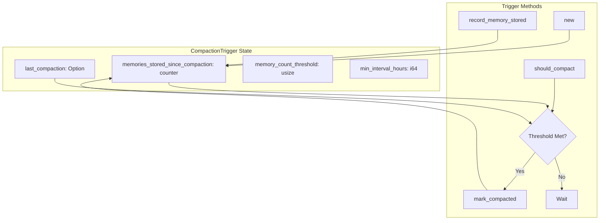

# CompactionTrigger

**Type:** technology

### From: compact

CompactionTrigger is a stateful mechanism that determines when memory compaction should execute based on configurable thresholds for memory count accumulation and time elapsed since the last compaction pass. The struct maintains internal counters tracking how many memories have been stored since the last compaction event, along with a timestamp recording when compaction most recently occurred. This design enables both time-based and load-based triggering strategies, allowing the system to adapt to varying usage patterns. When the memory count threshold is exceeded or the minimum interval between compactions has passed, the should_compact method returns true, signaling that maintenance operations should commence. The trigger automatically resets its counters upon compaction completion through the mark_compacted method, establishing a clean state for the next monitoring period. This pattern prevents excessive compaction overhead during high-throughput periods while ensuring that maintenance eventually runs even under light loads through the time-based fallback mechanism.

## Diagram

## External Resources

- [Rust standard library synchronization primitives used for thread-safe trigger state management](https://doc.rust-lang.org/std/sync/) - Rust standard library synchronization primitives used for thread-safe trigger state management

## Sources

- [compact](../sources/compact.md)
