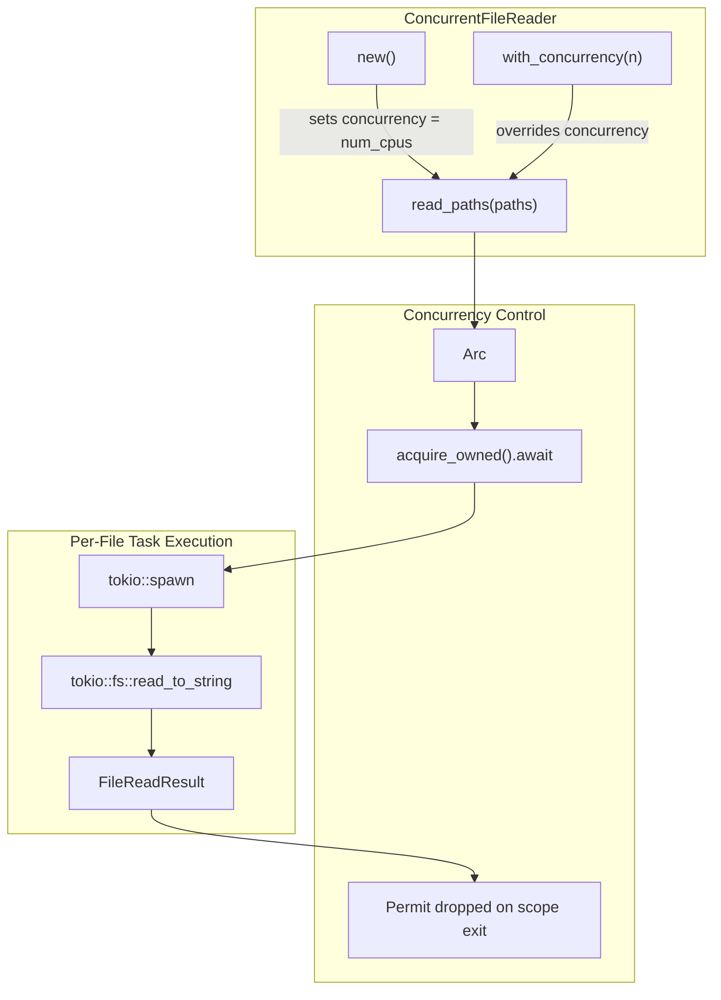

# ConcurrentFileReader

**Type:** technology

### From: mod

The ConcurrentFileReader is a foundational struct in the ragent-core file operations module that enables parallel reading of multiple files with controlled concurrency. It is designed with a builder-pattern style API where instances are created with a default concurrency level matching the number of CPU cores, and can be customized using the with_concurrency method to set specific limits. The struct uses Tokio's Semaphore for flow control, ensuring that resource consumption remains bounded even when processing large file sets. When read_paths is invoked, it spawns asynchronous tasks for each file, with each task acquiring a permit before proceeding, thereby respecting the concurrency constraint. This design is particularly valuable in scenarios such as batch processing of configuration files, source code analysis, or log aggregation where I/O parallelism can significantly improve throughput. The struct also maintains input order in its output, returning a Vec<FileReadResult> that preserves the iteration order of the provided paths, which is essential for deterministic processing pipelines.

## Diagram

## External Resources

- [Tokio Semaphore documentation for async concurrency control](https://docs.rs/tokio/latest/tokio/sync/struct.Semaphore.html) - Tokio Semaphore documentation for async concurrency control
- [num_cpus crate for detecting available CPU cores](https://docs.rs/num_cpus/latest/num_cpus/) - num_cpus crate for detecting available CPU cores

## Sources

- [mod](../sources/mod.md)
