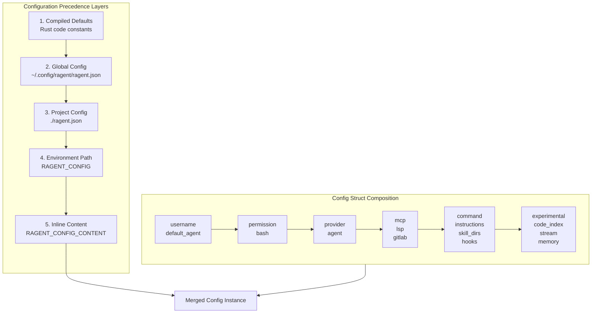

# Config

**Type:** technology

### From: mod

The `Config` struct serves as the apex configuration container for the entire ragent system, implementing a comprehensive hierarchy of settings that govern every aspect of agent behavior. This top-level structure orchestrates user identity through the `username` field, establishes the default agent selection mechanism, and provides HashMap-based collections for dynamic provider, agent, and command configurations. The design embraces Rust's ownership and type safety patterns, using `Option<String>` for optional fields and serde's default attribute patterns to ensure backward compatibility.

The struct's architecture reflects deep consideration for extensibility and real-world deployment scenarios. Provider configurations are keyed by identifier strings, enabling multi-tenant scenarios where different agents might leverage different LLM backends. The permission system uses a vector of `PermissionRule` structures, allowing fine-grained security policies that can be layered across global and per-agent scopes. Integration points span multiple protocols: MCP servers for tool extensibility, LSP servers for code intelligence, and GitLab for DevOps workflows.

The configuration loading methodology implements defense in depth for settings management. Rather than simple file-based loading, ragent employs a five-layer precedence system: compiled defaults establish baseline behavior, global configuration files in the user's config directory provide machine-specific settings, project-local `ragent.json` files enable repository-specific customization, the `RAGENT_CONFIG` environment variable permits deployment-time flexibility, and `RAGENT_CONFIG_CONTENT` enables ephemeral configuration injection for containerized or CI/CD environments. This layering ensures that sensitive credentials can remain in environment variables while operational defaults reside in versioned project files.

## Diagram

## External Resources

- [Serde field attributes for default values and customization](https://serde.rs/attributes.html) - Serde field attributes for default values and customization
- [Anyhow error handling library used in configuration loading](https://docs.rs/anyhow/latest/anyhow/) - Anyhow error handling library used in configuration loading
- [dirs-rs library for standard directory resolution](https://dirs.dev/) - dirs-rs library for standard directory resolution

## Sources

- [mod](../sources/mod.md)

### From: test_agent

The `Config` struct represents the centralized configuration management system within ragent-core, providing a cohesive mechanism for controlling system-wide behavior and agent defaults. This struct implements the `Default` trait, enabling straightforward instantiation of baseline configurations through `Config::default()`. The configuration instance serves as a dependency injection point for the agent resolution system, allowing external control over resolution behavior without modifying core logic.

In the context of agent resolution, the Config struct likely encapsulates multiple configuration domains including model provider settings, default agent parameters, and possibly custom agent definitions loaded from external sources. Its presence as a required parameter for `resolve_agent` indicates that all agent resolution is context-dependent, even when using default values. This design supports testing scenarios by allowing isolated configuration instances, as demonstrated in both test functions which create independent Config instances.

The Config struct's role extends beyond simple value storage to act as a policy enforcement mechanism. By controlling what configuration is passed to resolution functions, callers can influence whether unknown agents are resolved through fallback mechanisms or potentially rejected based on policy settings. The default implementation provides sensible out-of-box behavior while the struct's architecture presumably supports customization through builder patterns, file-based loading, or environment variable integration.

### From: test_config

The Config struct is the central configuration type in ragent-core, defining all available options for agent behavior and system integration. Based on the test code, it includes fields for identifying the user (username), selecting AI providers and agents, managing permissions, configuring commands, setting up Model Context Protocol (MCP) connections, providing system instructions, and enabling experimental features. The type implements Deserialize from serde, allowing configuration from JSON and potentially other formats.

A particularly notable design aspect is the merge method, which implements non-destructive configuration combination. Unlike simple struct updates that would replace entire values, this merge preserves existing values when the overlay doesn't specify them, and intelligently combines vector fields through appending rather than replacement. This enables powerful configuration layering where a base configuration can be progressively enhanced without losing previously set values.

The default values demonstrate thoughtful UX design: "general" as the default agent provides immediate usability, empty collections allow incremental building, and disabled experimental features ensure stability. The Option<String> type for username suggests optional authentication that may be provided through other mechanisms like environment variables or external identity providers.
