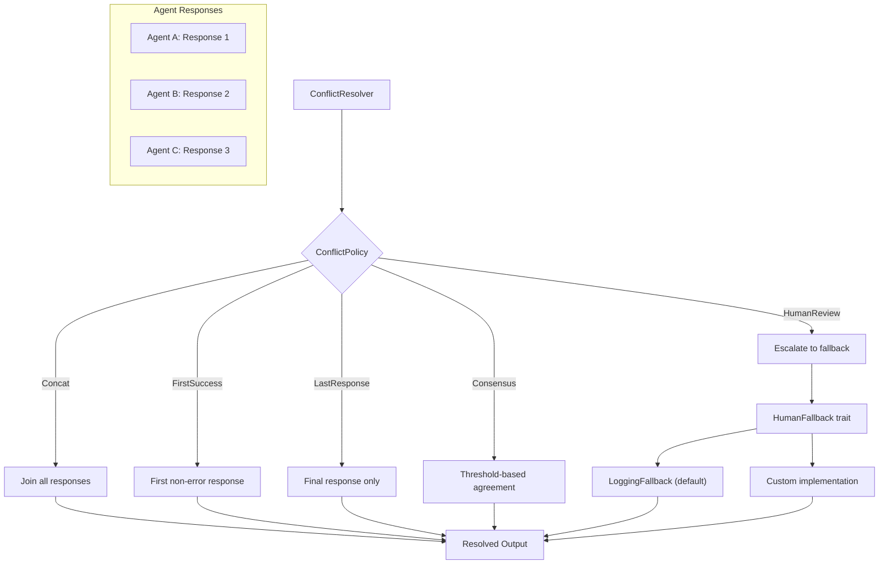

# ConflictResolver

**Type:** technology

### From: policy

The ConflictResolver is the central orchestration component that applies conflict resolution policies to collections of agent responses. Implemented as a thread-safe, cloneable struct using Arc for shared ownership of fallback handlers, it serves as the primary interface between the coordinator's execution logic and the policy subsystem. The resolver maintains two pieces of state: a ConflictPolicy determining which strategy to apply, and a HumanFallback handler for escalation scenarios. Its design reflects careful attention to ownership patterns in concurrent Rust applications, allowing policy configurations to be shared across async task boundaries without cloning heavy fallback implementations.

The resolver's resolve method implements a comprehensive match statement that dispatches to the appropriate resolution logic based on the configured policy. Each branch handles edge cases such as empty response sets, error propagation, and formatting of consolidated outputs. The method signature accepts a job identifier and a slice of agent-response pairs, returning a Result that encapsulates either the resolved string or a descriptive error. This API design enables straightforward integration with the broader Coordinator while providing sufficient flexibility for diverse agent interaction patterns. The implementation includes #[must_use] annotations on constructors to prevent accidental construction without utilization, reflecting defensive API design practices.

The ConflictResolver supports dependency injection of custom fallback handlers through the with_fallback constructor, enabling teams to integrate organizational-specific approval workflows without modifying core library code. This extensibility point is crucial for production deployments where regulatory requirements or operational practices mandate particular notification channels or audit trails. The default LoggingFallback implementation ensures that the resolver functions out-of-the-box while clearly signaling when human intervention would be appropriate, supporting gradual adoption of more sophisticated escalation procedures.

## Diagram

## External Resources

- [Rust Arc documentation for shared ownership patterns](https://doc.rust-lang.org/std/sync/struct.Arc.html) - Rust Arc documentation for shared ownership patterns
- [Anyhow crate for idiomatic error handling in Rust](https://docs.rs/anyhow/latest/anyhow/) - Anyhow crate for idiomatic error handling in Rust

## Sources

- [policy](../sources/policy.md)
