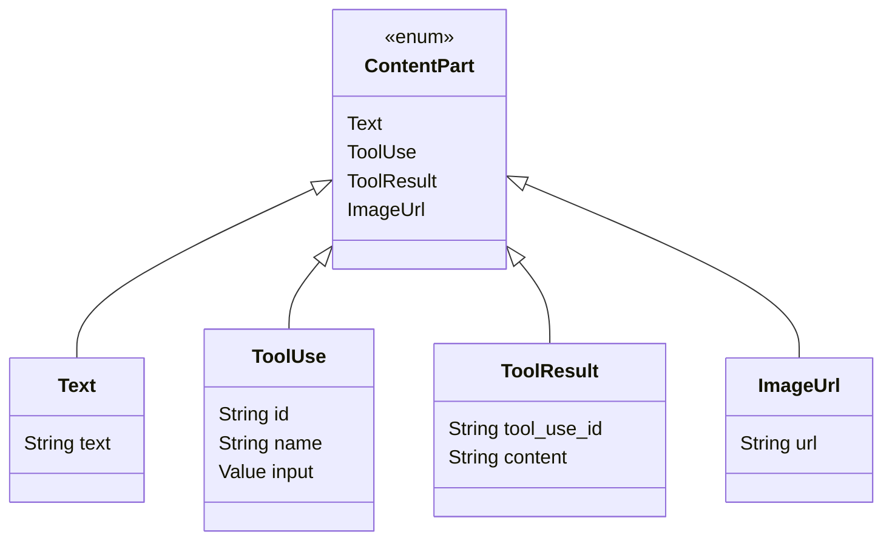

# ContentPart

**Type:** technology

### From: mod

The `ContentPart` enum defines the atomic units of structured message content, using `#[serde(tag = "type", rename_all = "snake_case")]` for explicit external serialization with discriminant fields. This representation creates clear JSON structures like `{"type": "text", "text": "..."}` or `{"type": "tool_use", "id": "...", "name": "...", "input": {...}}`, matching conventions established by major LLM providers. The four variants—`Text`, `ToolUse`, `ToolResult`, and `ImageUrl`—cover the essential content types for modern conversational AI: plain text generation, function calling requests, function return values, and multimodal image inputs.

The `ToolUse` variant carries `id: String`, `name: String`, and `input: Value` fields, where the `serde_json::Value` enables arbitrary JSON tool arguments while a TODO comment indicates future plans for typed schema validation. The `ToolResult` variant mirrors this with `tool_use_id: String` for correlation and `content: String` for stringified output, following the pattern where tools return JSON-serializable data. The `ImageUrl` variant's single `url: String` field accepts both public HTTPS URLs and data URIs (`data:image/png;base64,...`), supporting both hosted and inline image transmission per industry standards.

This enum's design reflects careful API evolution considerations. The tagged representation ensures forward compatibility—clients encountering unknown `type` values can fail gracefully or preserve raw data. The snake_case naming aligns with JSON conventions across OpenAI, Anthropic, and similar services. The explicit struct variants with named fields improve code clarity compared to tuple variants, while the `Clone` derive enables content reuse across message copies.

## Diagram

## External Resources

- [RFC 2397: The 'data' URL scheme](https://datatracker.ietf.org/doc/html/rfc2397) - RFC 2397: The 'data' URL scheme
- [serde_json::Value documentation for arbitrary JSON handling](https://docs.rs/serde_json/latest/serde_json/value/enum.Value.html) - serde_json::Value documentation for arbitrary JSON handling

## Sources

- [mod](../sources/mod.md)
