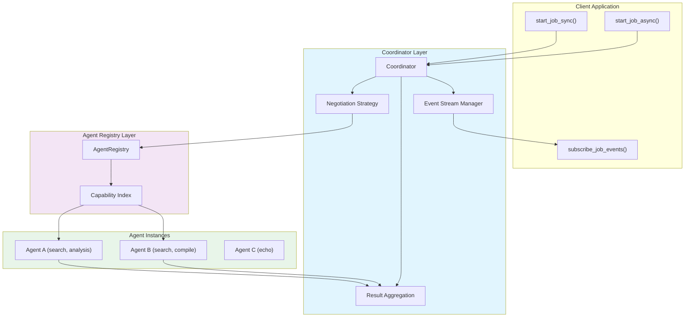

# Coordinator

**Type:** technology

### From: mod

The Coordinator is the central orchestration component in the ragent-core system, responsible for managing the lifecycle of multi-agent jobs from initiation through completion. Implemented as a Rust struct within the `coordinator` submodule, it provides both synchronous (`start_job_sync`) and asynchronous (`start_job_async`) execution modes, enabling flexible integration patterns depending on client requirements. The Coordinator interacts with the AgentRegistry to discover agents matching required capabilities, negotiates task distribution, and aggregates results from multiple participating agents. Its design incorporates basic negotiation strategies for determining optimal agent selection and result aggregation patterns, making it suitable for complex workflows requiring collaborative agent behavior. The Coordinator also maintains event streams that clients can subscribe to for real-time job progress monitoring, supporting observability requirements in production deployments.

The Coordinator's architecture reflects modern distributed systems principles, utilizing Rust's async/await patterns for non-blocking execution while maintaining type safety through compile-time checks. In the test implementation, we observe the Coordinator instantiated with a cloned registry reference (`Coordinator::new(registry.clone())`), demonstrating shared-state patterns common in actor systems. The Coordinator handles JobDescriptor configurations that specify unique job identifiers, required agent capabilities (like "search" or "analysis"), and opaque payloads that agents interpret according to their specialization. This capability-based matching abstracts away specific agent instances, enabling dynamic scaling and fault tolerance where alternative agents can fulfill requirements if primary agents become unavailable. The async execution path returns job identifiers immediately while spawning background processing, with companion methods like `subscribe_job_events` and `get_job_result` providing eventual consistency semantics for result retrieval.

## Diagram

## External Resources

- [Tokio async runtime documentation for understanding the async execution model used by Coordinator](https://docs.rs/tokio/latest/tokio/) - Tokio async runtime documentation for understanding the async execution model used by Coordinator
- [Futures and promises pattern explaining async result handling in the Coordinator](https://en.wikipedia.org/wiki/Futures_and_promises) - Futures and promises pattern explaining async result handling in the Coordinator
- [Rust ownership and concurrency patterns essential to Coordinator's memory-safe design](https://www.rust-lang.org/learn/thinking-in-rust) - Rust ownership and concurrency patterns essential to Coordinator's memory-safe design

## Sources

- [mod](../sources/mod.md)
