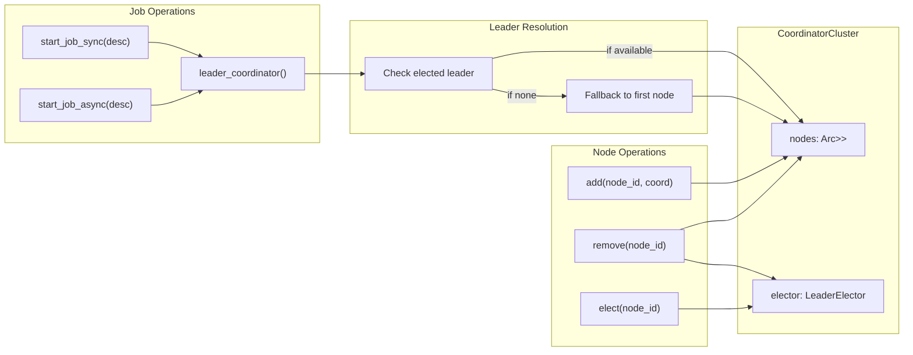

# CoordinatorCluster

**Type:** technology

### From: leader

CoordinatorCluster is a Rust struct that manages a collection of named Coordinator instances with leader-based job routing capabilities. The struct combines a LeaderElector for determining which node should handle coordination duties with a HashMap storing the actual Coordinator instances by their node IDs. This architecture enables dynamic cluster membership where nodes can join and leave while maintaining continuous job execution capability. The cluster provides both synchronous and asynchronous job execution methods that automatically route work to the current leader, with automatic fallback to any available coordinator if no leader has been elected. This fallback mechanism ensures system availability even during leader election transitions or in single-node deployments.

The implementation demonstrates sophisticated use of Rust's ownership and concurrency patterns. The nodes HashMap is wrapped in Arc<RwLock<>> for thread-safe shared access across async boundaries. Methods like add and remove modify cluster membership, with remove automatically withdrawing the departing node's vote to trigger re-election if necessary. The leader_coordinator method implements a two-tier lookup strategy: first attempting to retrieve the elected leader's coordinator, then falling back to the first registered node if no leader exists. This design prioritizes availability over strict consistency during transitions.

CoordinatorCluster represents a pragmatic approach to distributed coordination that balances correctness with operational simplicity. The job routing methods start_job_sync and start_job_async return Result types with descriptive error messages when no coordinators are available, enabling callers to implement appropriate retry or circuit-breaker logic. The cluster can be cloned cheaply due to Arc-wrapped fields, allowing it to be shared across multiple async tasks. This makes it suitable for integration with web servers or other concurrent workloads where multiple requests need to submit jobs to the cluster. The design pattern shown here is common in microservices orchestration, batch processing systems, and task queue implementations where work must be delegated to exactly one coordinator while maintaining fault tolerance.

## Diagram

## External Resources

- [Tokio shared state patterns with RwLock](https://tokio.rs/tokio/topics/shared-state) - Tokio shared state patterns with RwLock
- [anyhow crate documentation for ergonomic error handling](https://docs.rs/anyhow/latest/anyhow/) - anyhow crate documentation for ergonomic error handling
- [Leader-Follower pattern in distributed systems](https://martinfowler.com/articles/patterns-of-distributed-systems/leader-follower.html) - Leader-Follower pattern in distributed systems

## Sources

- [leader](../sources/leader.md)
