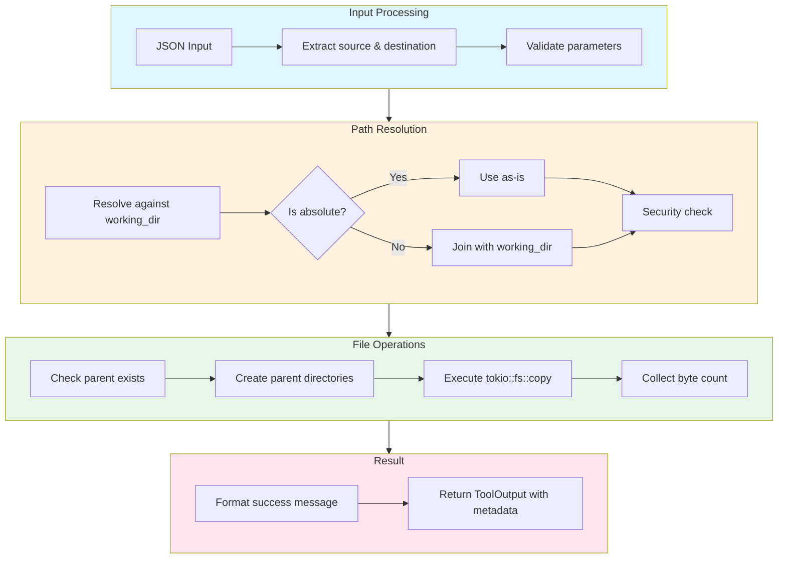

# CopyFileTool

**Type:** technology

### From: copy_file

CopyFileTool is a Rust struct that implements a file copying utility within a broader tool framework. It provides a secure, asynchronous interface for copying files from one location to another while maintaining strict security boundaries. The tool is designed to be instantiated as a unit struct (containing no fields) and implements the Tool trait through the async_trait procedural macro, enabling it to participate in a dynamic tool registry system. Its architecture emphasizes safety through path resolution that prevents directory traversal, automatic parent directory creation, and integration with a permission categorization system.

The implementation demonstrates sophisticated error handling patterns typical of production Rust code. It uses the `anyhow` crate to provide rich error context throughout the operation chain, from parameter validation through file system operations. The tool's `execute` method orchestrates a complete workflow: extracting source and destination paths from JSON input, resolving these paths against a working directory context, validating both paths remain within the permitted root directory, ensuring destination parent directories exist, performing the actual copy via `tokio::fs::copy`, and returning structured output with operation metadata. This comprehensive approach ensures that failures at any stage provide actionable diagnostic information.

From a systems design perspective, CopyFileTool exemplifies the principle of defense in depth. The security model incorporates multiple layers: JSON schema validation ensures well-formed inputs, explicit parameter extraction with context-rich error messages prevents missing data, path resolution handles both absolute and relative paths safely, and the `check_path_within_root` validation (from the parent module) prevents escape from the designated sandbox. The permission category "file:write" allows the hosting system to apply appropriate access controls, potentially restricting this tool's availability based on user trust levels or session configuration. This design makes CopyFileTool suitable for deployment in multi-tenant or untrusted execution environments where file system access must be carefully constrained.

## Diagram

## External Resources

- [Tokio async runtime documentation for understanding async file operations](https://tokio.rs/tokio/tutorial) - Tokio async runtime documentation for understanding async file operations
- [Anyhow error handling library documentation](https://docs.rs/anyhow/latest/anyhow/) - Anyhow error handling library documentation
- [async_trait procedural macro for async trait methods](https://docs.rs/async-trait/latest/async_trait/) - async_trait procedural macro for async trait methods

## Sources

- [copy_file](../sources/copy-file.md)
