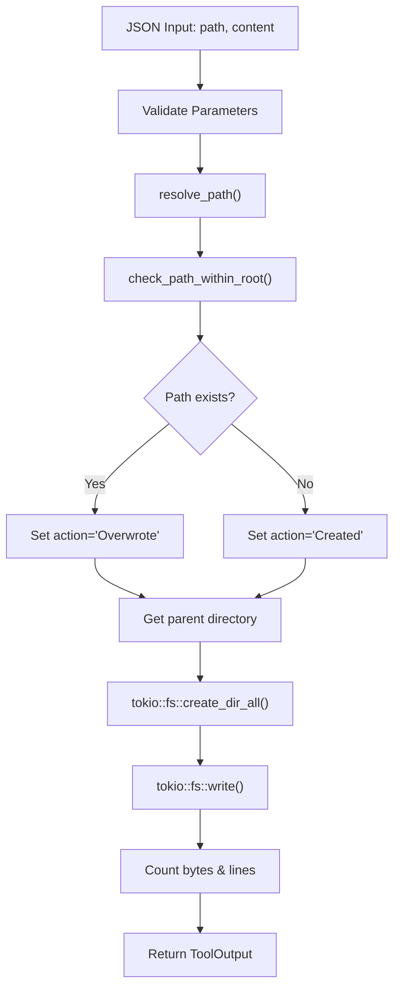

# CreateTool

**Type:** technology

### From: create

CreateTool is a concrete implementation of the Tool trait in the ragent-core crate, designed to provide safe, asynchronous file creation capabilities for agent systems. This struct represents a fundamental building block in agent architectures where discrete, composable tools enable agents to interact with their environment. Unlike simple file writing utilities, CreateTool is designed with security and observability as first-class concerns, integrating into a permission-based system through its "file:write" category classification.

The implementation demonstrates sophisticated handling of edge cases common in production file systems. When executed, it first validates required parameters (path and content) from JSON input, then resolves the path relative to a working directory root to prevent directory traversal attacks. The tool automatically creates parent directories as needed using Tokio's asynchronous filesystem APIs, ensuring non-blocking operation suitable for concurrent agent workloads. Notably, the tool handles both creation and overwrite scenarios gracefully, reporting whether the file was newly created or replaced.

CreateTool exemplifies modern Rust patterns for system tools, combining the `anyhow` crate's ergonomic error handling with structured output via `serde_json`. The output includes both human-readable summaries and machine-parseable metadata, reflecting its dual role in user-facing and programmatic contexts. This design enables integration into larger agent orchestration systems where tool execution results must be consumed by both humans and downstream automation. The async_trait macro enables the trait to be used with async methods, a necessary pattern for I/O-bound operations in Rust's ecosystem.

## Diagram

## External Resources

- [Tokio asynchronous filesystem documentation](https://docs.rs/tokio/latest/tokio/fs/) - Tokio asynchronous filesystem documentation
- [Anyhow error handling crate documentation](https://docs.rs/anyhow/latest/anyhow/) - Anyhow error handling crate documentation
- [async_trait proc macro for async traits in Rust](https://docs.rs/async-trait/latest/async_trait/) - async_trait proc macro for async traits in Rust

## Sources

- [create](../sources/create.md)
