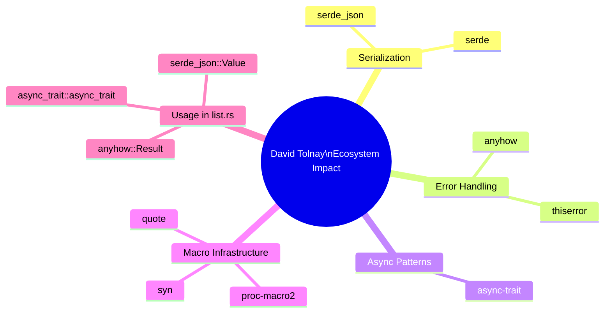

# David Tolnay

**Type:** person

### From: list

David Tolnay is one of the most influential contributors to the modern Rust ecosystem, having authored foundational libraries that address core language limitations and shape community best practices. As the creator of serde, the serialization framework that has become the de facto standard for data interchange in Rust, Tolnay established patterns for zero-cost abstractions that maintain performance while providing exceptional developer ergonomics. His contributions extend across virtually every domain of Rust development: proc-macro2 and quote for procedural macro authoring, syn for parsing Rust syntax, anyhow and thiserror for error handling, async-trait for asynchronous patterns, and dozens of other crates that form the infrastructure layer of the Rust ecosystem. These libraries collectively demonstrate Tolnay's approach to API design: identifying friction points in the language, implementing robust solutions, and maintaining them with careful attention to backwards compatibility and documentation quality.

The presence of Tolnay's work in `list.rs`—specifically anyhow, serde_json, and async-trait—illustrates the pervasiveness of his contributions in production Rust code. This is not coincidental but reflects deliberate ecosystem-wide adoption of solutions that have proven reliable through extensive production use. Tolnay's crates consistently prioritize compile-time guarantees and runtime performance, aligning with Rust's core value proposition. His maintenance practices, including rapid response to issues, thorough changelogs, and conservative versioning, have established trust that encourages widespread dependency. For developers building agent systems and similar complex applications, Tolnay's libraries provide the foundational abstractions that allow focus on domain logic rather than infrastructure concerns.

Tolnay's influence extends beyond code contribution to shaping Rust's evolution and community standards. He has been instrumental in stabilizing language features through his work on implementation and specification, particularly in the areas of macros and error handling. His blog posts and GitHub issue discussions often serve as authoritative explanations of complex Rust behaviors, filling documentation gaps with practical guidance. The design patterns established in his crates—such as the builder pattern in derive macros, context attachment in error handling, and async transformation in traits—have become community conventions taught in Rust courses and emulated in other libraries.

The concentration of Tolnay's crates in foundational positions within dependency graphs has sparked important community discussions about bus factor and supply chain security, leading to increased sponsorship and organizational support for his maintenance work. This recognition acknowledges the reality that modern software development relies on individual expertise and sustained effort. For the Rust agent ecosystem specifically, Tolnay's contributions enable the rapid development of sophisticated tools like ListTool by providing battle-tested solutions for serialization, error handling, and async execution—concerns that would otherwise require substantial custom implementation or acceptance of inferior alternatives.

## Diagram

## External Resources

- [David Tolnay's GitHub profile with repository listings](https://github.com/dtolnay) - David Tolnay's GitHub profile with repository listings
- [crates.io profile showing published crates and download statistics](https://crates.io/users/dtolnay) - crates.io profile showing published crates and download statistics
- [GitHub Sponsors page for supporting Tolnay's open source work](https://github.com/sponsors/dtolnay) - GitHub Sponsors page for supporting Tolnay's open source work

## Sources

- [list](../sources/list.md)

### From: wrapper

David Tolnay is one of the most prolific and influential contributors to the Rust ecosystem, responsible for creating and maintaining numerous foundational crates that underpin modern Rust development. His work includes serde (the serialization framework), syn and quote (proc-macro infrastructure), anyhow and thiserror (error handling), and many others. Tolnay's crates are characterized by exceptional API design, comprehensive documentation, and remarkable stability—qualities that have made them de facto standards in the ecosystem.

Tolnay's influence extends beyond individual crates to shaping Rust community norms and best practices. He has been instrumental in developing the procedural macro system that enables Rust's powerful derive attributes, and his contributions to the Rust compiler and language design demonstrate deep technical expertise. His crates often solve fundamental problems with elegant abstractions that hide complexity without sacrificing performance or correctness. The presence of anyhow in `wrapper.rs` is a testament to the trust the broader community places in his work.

Beyond code contributions, Tolnay has served on the Rust Language Design Team and participates in standard library development. His approach to open source maintenance—responsive to issues, careful about breaking changes, and thoughtful about scope—serves as a model for sustainable ecosystem development. Developers using Rust in production frequently depend on a "Tolnay stack" of crates without necessarily knowing it, testament to how thoroughly his work has permeated the ecosystem. His influence on Rust's growth from a niche systems language to a mainstream development platform cannot be overstated.
