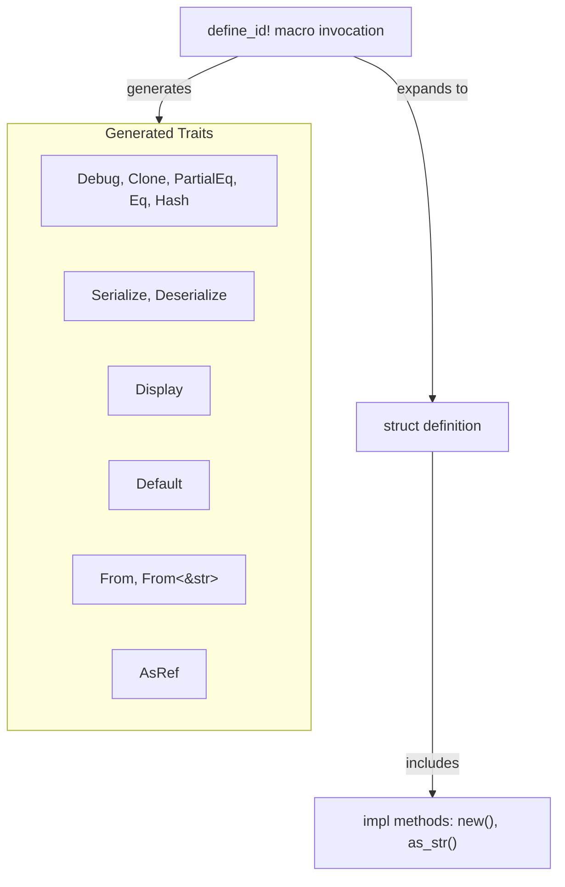

# define_id macro

**Type:** technology

### From: id

The `define_id!` macro is a declarative Rust macro (using `macro_rules!`) that automates the generation of newtype wrapper structs for string-based identifiers. This macro accepts two parameters: an identifier name and a documentation string, then generates a complete struct definition with approximately ten standard trait implementations. The generated code includes essential traits like `Debug`, `Clone`, `PartialEq`, `Eq`, `Hash` for basic operations, `Serialize` and `Deserialize` for data interchange, `Display` for string representation, `Default` for convenient initialization, and multiple conversion traits (`From<String>`, `From<&str>`, `AsRef<str>`) for ergonomic string interoperation. The macro also embeds methods for creating new random UUID-based identifiers and accessing the underlying string slice. This design eliminates repetitive boilerplate code while ensuring all identifier types maintain consistent behavior and interface contracts across the codebase.

## Diagram

## External Resources

- [Rust reference documentation for declarative macros (macro_rules!)](https://doc.rust-lang.org/reference/macros-by-example.html) - Rust reference documentation for declarative macros (macro_rules!)
- [Rust newtype pattern documentation and examples](https://doc.rust-lang.org/rust-by-example/generics/new_types.html) - Rust newtype pattern documentation and examples

## Sources

- [id](../sources/id.md)
