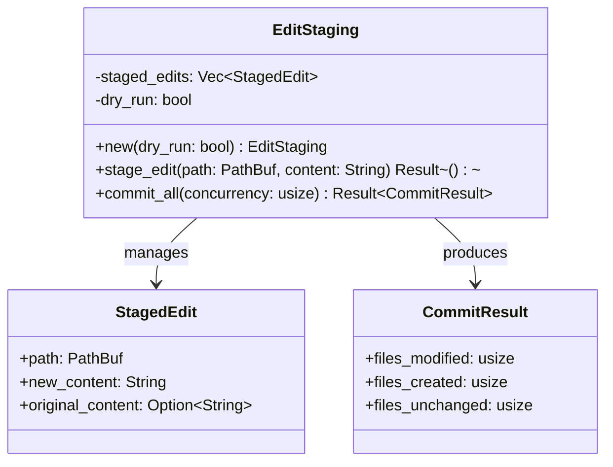

# EditStaging

**Type:** technology

### From: api

EditStaging is a core type in the ragent-core file operations system that implements a staging workflow for file modifications. This pattern, analogous to Git's staging area or database transaction logs, provides a buffer between the declaration of intended changes and their actual application to the filesystem. By separating these concerns, EditStaging enables important capabilities like dry-run validation, conflict detection, and atomic-or-near-atomic batch operations that would be difficult or impossible with direct immediate writes.

The staging pattern implemented by EditStaging addresses several challenges inherent in automated file modification systems. In agent-based programming assistants, multiple tools or reasoning steps may propose changes to the same files or interdependent files. Without staging, these operations could interfere with each other or leave the filesystem in an inconsistent state if partial failures occur. EditStaging accumulates changes in memory (or temporary storage), performs validation checks such as detecting conflicting edits to the same file, and only commits when explicitly instructed. This design supports the `apply_batch_edits` function's contract of reliable batch operations.

The type exposes at least three key operations as evidenced by the API usage: `new` for initialization with dry-run configuration, `stage_edit` for accumulating individual file changes, and `commit_all` for finalizing operations with controlled concurrency. The async nature of `stage_edit` suggests that it may perform validation I/O such as reading existing file content to compute diffs or verify file existence. The `commit_all` operation's concurrency parameter indicates sophisticated resource management, likely using tokio or similar async runtime capabilities to parallelize write operations while maintaining ordering constraints and handling errors from multiple concurrent tasks.

## Diagram

## External Resources

- [Unit of Work pattern - architectural pattern for batch operations](https://martinfowler.com/eaaCatalog/unitOfWork.html) - Unit of Work pattern - architectural pattern for batch operations
- [Git Staging Area concept](https://git-scm.com/book/en/v2/Git-Basics-Recording-Changes-to-the-Repository) - Git Staging Area concept

## Sources

- [api](../sources/api.md)
