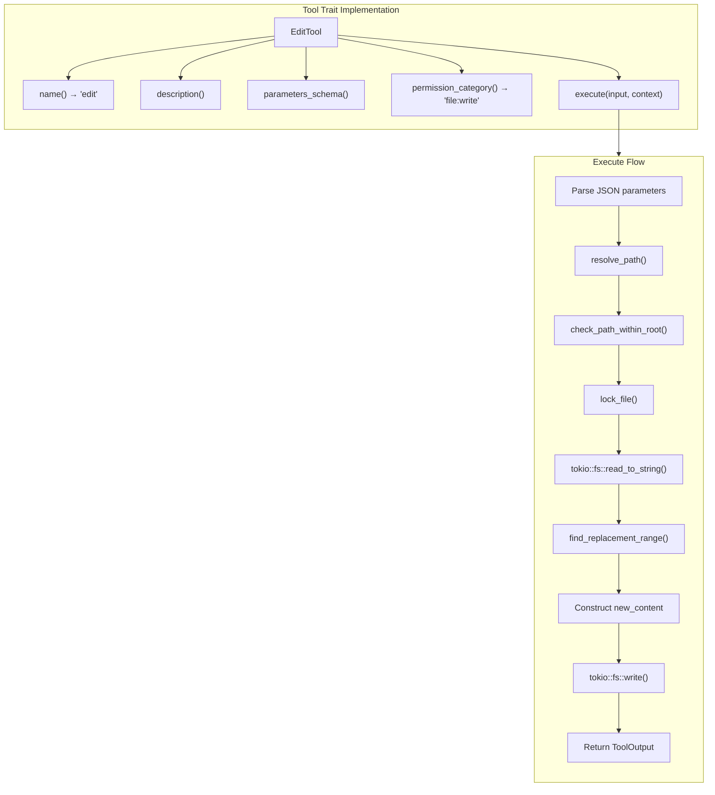

# EditTool

**Type:** technology

### From: edit

EditTool is a Rust struct implementing the Tool trait for precise file modification operations. It serves as the primary interface for surgical text replacement within a larger agent-based code editing system. The tool is designed with LLM workflows specifically in mind, acknowledging that generated code snippets may not exactly match file contents due to common formatting discrepancies. The struct itself is minimal—an empty unit struct—because all behavior is implemented through the Tool trait, following Rust's preference for zero-cost abstractions and trait-based polymorphism. This design allows the tool to participate in a larger plugin architecture where different tools can be uniformly invoked through a common interface.

The tool's significance lies in its progressive matching strategy, which attempts five different matching approaches in order of strictness. This design reflects real-world experience with LLM-based editing: exact matches are rare when models process file contents through intermediate representations that normalize whitespace or line endings. The tool maintains strict safety invariants despite its fuzzy matching—uniqueness is enforced at every level, and the operation fails rather than making ambiguous replacements. The permission category "file:write" integrates with a broader security model, ensuring that file system operations are appropriately authorized. The tool produces structured metadata about its operations, including line counts for both original and replacement text, enabling downstream components to reason about the scope of changes.

The implementation demonstrates sophisticated Rust patterns including async/await for non-blocking I/O, the anyhow crate for ergonomic error handling with context propagation, and serde_json for schema definition and structured output. The use of tokio::fs operations ensures the tool is suitable for high-concurrency agent systems where multiple files may be processed simultaneously. The file locking mechanism prevents race conditions when concurrent editing operations target the same file, a critical consideration for systems where multiple LLM agents or tool invocations may overlap in time.

## Diagram

## External Resources

- [Tokio async runtime documentation for the asynchronous file operations used in EditTool](https://tokio.rs/tokio/tutorial) - Tokio async runtime documentation for the asynchronous file operations used in EditTool
- [Anyhow error handling library for Rust context propagation](https://docs.rs/anyhow/latest/anyhow/) - Anyhow error handling library for Rust context propagation
- [Serde serialization framework for JSON schema and metadata handling](https://serde.rs/) - Serde serialization framework for JSON schema and metadata handling

## Sources

- [edit](../sources/edit.md)
