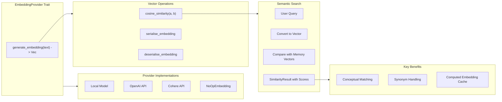

# EmbeddingProvider

**Type:** technology

### From: mod

EmbeddingProvider is the trait-based abstraction that enables semantic search capabilities within ragent's memory system, allowing agents to find relevant memories based on meaning rather than exact keyword matching. This component sits at the heart of the embedding module, providing a pluggable interface for different vector embedding implementations while maintaining a consistent API for the rest of the system. The trait design enables swappable backends—from local models to cloud-based APIs like OpenAI's text-embedding-3 or Cohere's embedding models—without requiring changes to consumer code. This flexibility is crucial for deployment scenarios ranging from air-gapped environments to resource-rich cloud deployments.

The module includes `NoOpEmbedding` as a fallback implementation for environments where embedding computation is unavailable or unnecessary, demonstrating defensive API design. The supporting functions `cosine_similarity`, `serialise_embedding`, and `deserialise_embedding` provide the mathematical and persistence foundations for vector operations. Cosine similarity enables efficient comparison of embedding vectors regardless of their magnitude, while the serialization functions ensure embeddings can be cached and retrieved without recomputation, addressing the significant computational cost of embedding generation.

The `SimilarityResult` type encapsulates search outcomes with relevance scores, enabling ranked retrieval of memory blocks. This semantic search capability transforms the memory system from a simple key-value store into an intelligent knowledge base that can surface relevant context even when terminology differs between queries and stored content. For AI agents, this means the ability to recall appropriate patterns, documentation, or previous solutions based on conceptual similarity rather than requiring precise terminology matches, significantly enhancing agent effectiveness in complex, evolving domains.

## Diagram

## External Resources

- [OpenAI embeddings API documentation](https://platform.openai.com/docs/guides/embeddings) - OpenAI embeddings API documentation
- [Cosine similarity mathematical foundation](https://en.wikipedia.org/wiki/Cosine_similarity) - Cosine similarity mathematical foundation
- [Sentence-Transformers library for local embeddings](https://www.sbert.net/) - Sentence-Transformers library for local embeddings

## Sources

- [mod](../sources/mod.md)
