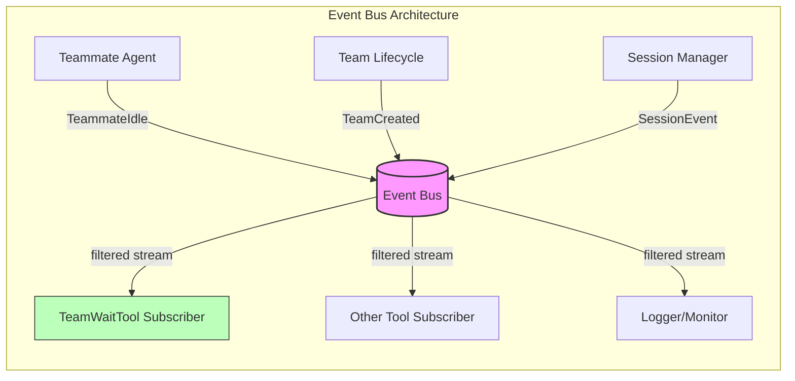

# Event Bus

**Type:** technology

### From: team_wait

The Event Bus represents the central publish-subscribe messaging infrastructure that enables loose coupling between agents in this multi-agent system. Implemented as a broadcast channel pattern in Tokio, it allows components to emit typed events without knowledge of specific consumers, while subscribers receive filtered streams of relevant occurrences.

In the context of TeamWaitTool, the event bus serves as the critical coordination backbone. The tool accesses the bus through ToolContext, obtaining a subscription that yields a Receiver<event::Event> for async iteration. The subscription mechanism uses Tokio's broadcast channels or similar patterns, enabling multiple concurrent subscribers while ensuring each receives a copy of relevant events. The TeammateIdle event specifically carries three identification fields: session_id for multi-session isolation, team_name for multi-tenancy separation, and agent_id for individual agent tracking.

The architectural decision to use event-driven coordination rather than direct method calls or shared memory reflects core principles of actor-model and message-passing concurrency. This approach naturally supports distribution across process or network boundaries, provides natural backpressure through channel buffering, and enables comprehensive audit logging through event interception. The subscription-based approach also eliminates the need for the waiting agent to maintain active connections to teammates, reducing coupling and failure surface area.

## Diagram

## External Resources

- [Tokio broadcast channel for publish-subscribe patterns](https://docs.rs/tokio/latest/tokio/sync/broadcast/index.html) - Tokio broadcast channel for publish-subscribe patterns
- [Actor model theoretical foundation for message-passing concurrency](https://en.wikipedia.org/wiki/Actor_model) - Actor model theoretical foundation for message-passing concurrency
- [Martin Fowler's patterns for event-driven architectures](https://martinfowler.com/articles/201701-event-driven.html) - Martin Fowler's patterns for event-driven architectures

## Sources

- [team_wait](../sources/team-wait.md)
