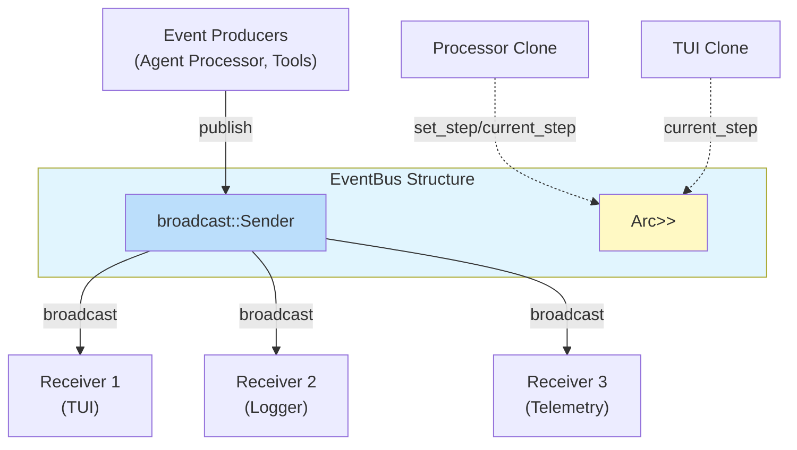

# EventBus

**Type:** technology

### From: mod

The EventBus is the central broadcast-based event distribution mechanism in ragent-core, implemented as a thread-safe, clonable struct that manages the flow of events from producers to multiple consumers. At its core, it wraps a Tokio broadcast::Sender<Event> which enables efficient, asynchronous message broadcasting to any number of subscribers through corresponding receivers. The broadcast pattern is particularly well-suited for this use case because it naturally supports fan-out scenarios where multiple independent components—such as a TUI renderer, a logging subsystem, and telemetry collectors—need to observe the same event stream without coordination between them.

A distinctive feature of this EventBus implementation is its integrated per-session step tracking capability. The struct maintains an Arc<RwLock<HashMap<String, u64>>> called steps, which maps session identifiers to their current loop step counters. This design elegantly solves the problem of distributed state management: because the HashMap is wrapped in both Arc (for shared ownership across clones) and RwLock (for safe concurrent access), every clone of the EventBus shares the same step counters. This is architecturally significant because different parts of the system—the processor handling agent logic and the TUI handling user interface updates—each hold their own clone of the bus, yet observe consistent step state. The RwLock provides read-heavy optimization, allowing concurrent reads while serializing writes.

The EventBus API exposes essential lifecycle methods: new(capacity) for creation with custom channel buffering, subscribe() for obtaining new receivers, and publish() for broadcasting events. The set_step and current_step methods provide atomic operations for session progress tracking. The default capacity of 256 events was chosen to balance memory usage against burst tolerance, preventing slow consumers from causing backpressure under normal loads while still bounding memory growth. When publishing, the implementation handles the case where all receivers have been dropped by checking is_err() on the send result and warning via tracing when events cannot be delivered, preventing panic while maintaining observability of subscriber health.

## Diagram

## External Resources

- [Tokio broadcast channel documentation - async multi-producer multi-consumer channels](https://docs.rs/tokio/latest/tokio/sync/broadcast/index.html) - Tokio broadcast channel documentation - async multi-producer multi-consumer channels
- [Rust RwLock documentation - reader-writer lock for shared state](https://doc.rust-lang.org/std/sync/struct.RwLock.html) - Rust RwLock documentation - reader-writer lock for shared state
- [Rust Arc documentation - atomically reference counted shared pointer](https://doc.rust-lang.org/std/sync/struct.Arc.html) - Rust Arc documentation - atomically reference counted shared pointer

## Sources

- [mod](../sources/mod.md)
