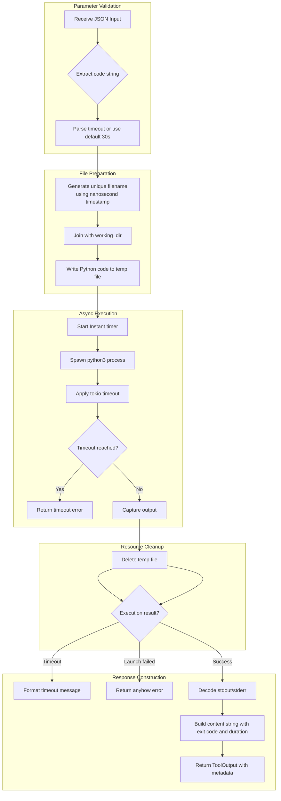

# ExecutePythonTool

**Type:** product

### From: execute_python

ExecutePythonTool is a production-grade Rust implementation designed to provide AI agents with controlled Python code execution capabilities. This component serves as a bridge between AI reasoning systems and practical computational tasks, allowing agents to perform calculations, data processing, file manipulation, and other operations that require programmatic execution. The tool operates by creating temporary Python files with unique names based on nanosecond timestamps, executing them in isolated working directories, and capturing all output streams for return to the calling agent. This file-based approach was chosen over direct command-line code execution to avoid shell injection vulnerabilities and argument length limitations.

The implementation prioritizes security through multiple defensive layers: configurable timeouts prevent infinite loops and resource exhaustion, temporary files are automatically cleaned up even on execution failure, and working directory isolation prevents unintended file system access. The tool provides detailed feedback including exit codes, execution duration in milliseconds, and line counts to help agents understand execution outcomes. Error handling distinguishes between timeout conditions, process launch failures (such as missing Python installations), and runtime errors within the Python code itself. The "bash:execute" permission category indicates integration with a broader authorization framework, allowing system administrators to control which agents or contexts can invoke code execution.

ExecutePythonTool exemplifies modern patterns in AI agent architecture, where tools are composable, well-documented, and safety-conscious. The JSON schema for parameters enables automatic UI generation and validation, while the structured ToolOutput type facilitates downstream processing by agent reasoning loops. The implementation leverages Rust's ownership and async/await features to handle concurrent executions safely without blocking the agent's event loop. By returning both human-readable content strings and machine-parseable metadata, the tool serves dual audiences: end users reviewing agent actions and the agent itself making decisions about next steps. This design reflects lessons from early AI agent systems where unrestricted code execution led to security incidents, demonstrating how careful engineering can enable powerful capabilities while maintaining system integrity.

## Diagram

## External Resources

- [Tokio process module documentation for async command execution](https://docs.rs/tokio/latest/tokio/process/) - Tokio process module documentation for async command execution
- [Serde JSON serialization framework used for parameter schemas](https://serde.rs/) - Serde JSON serialization framework used for parameter schemas
- [Anyhow error handling library for ergonomic Rust error propagation](https://anyhow.rs/) - Anyhow error handling library for ergonomic Rust error propagation

## Sources

- [execute_python](../sources/execute-python.md)
