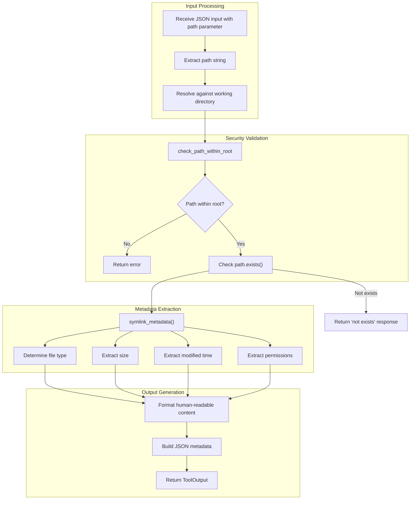

# FileInfoTool

**Type:** product

### From: file_info

FileInfoTool is a concrete implementation of the `Tool` trait designed to retrieve and format file system metadata. It serves as a bridge between higher-level application logic and low-level file system operations, providing a standardized interface for querying file properties. The tool is architected to be embedded within a larger agent or automation framework, as suggested by its location in the `ragent-core` crate and its implementation of async trait methods. Its design philosophy emphasizes security, cross-platform compatibility, and minimal external dependencies.

The tool's functionality encompasses several critical file system attributes: existence verification, file type classification (distinguishing between regular files, directories, and symbolic links), size reporting in bytes, modification timestamp conversion to UTC, and permission metadata. On Unix systems, it reports traditional octal permission modes, while on other platforms it provides a simplified read-only versus read-write distinction. This dual-mode operation ensures consistent API behavior across different operating environments without sacrificing platform-appropriate detail where available.

FileInfoTool implements security through path validation. Before accessing any file, it resolves the provided path against a working directory and validates that the resulting absolute path remains within the authorized root directory. This prevents directory traversal attacks where malicious input like `../../../etc/passwd` could escape intended sandbox boundaries. The tool uses `symlink_metadata` rather than standard metadata to ensure that symbolic link information is retrieved directly rather than following links, which is important for security auditing and accurate file system representation.

## Diagram

## External Resources

- [Rust standard library documentation for symlink_metadata, which retrieves metadata without following symbolic links](https://doc.rust-lang.org/std/fs/fn.symlink_metadata.html) - Rust standard library documentation for symlink_metadata, which retrieves metadata without following symbolic links
- [async-trait crate documentation for async methods in traits](https://docs.rs/async-trait/latest/async_trait/) - async-trait crate documentation for async methods in traits

## Sources

- [file_info](../sources/file-info.md)
