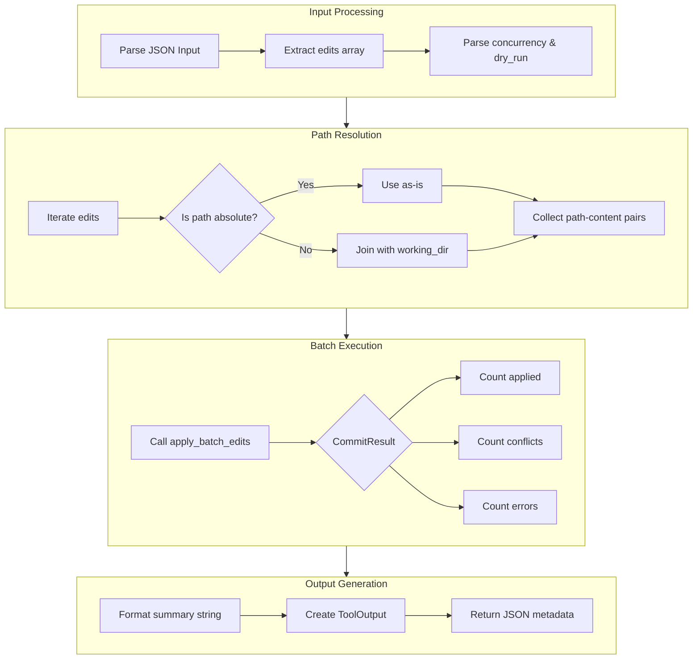

# FileOpsTool

**Type:** product

### From: file_ops_tool

The `FileOpsTool` is a concrete implementation of a file operations tool designed for agent-based architectures in Rust. It encapsulates the functionality needed to perform batch file edits with concurrency control, conflict detection, and optional dry-run execution. The tool is structured as a zero-sized struct (`pub struct FileOpsTool;`) with no fields, relying entirely on its trait implementation to provide behavior. This design pattern is common in Rust for stateless service objects that configure themselves through method parameters rather than internal state.

The tool's architecture follows the command pattern where the `execute` method receives structured JSON input containing an array of edit operations. Each edit specifies a target file path and new content. The tool handles path resolution, converting relative paths to absolute paths using a working directory context, which is essential for security and reproducibility in agent environments. The implementation demonstrates sophisticated error handling through the `anyhow` crate, providing contextual error messages that aid debugging when inputs are malformed or operations fail.

The `FileOpsTool` integrates with a broader `EditStaging` system through the `apply_batch_edits` function, suggesting a multi-stage commit process where edits are validated, staged, and potentially rolled back if conflicts arise. This transactional semantics makes it suitable for code generation tasks, automated refactoring, and other scenarios where partial success would leave the system in an inconsistent state. The tool outputs structured results including the count of successful applications, conflicts detected, and errors encountered.

## Diagram

## External Resources

- [Rust standard library Path documentation for path manipulation](https://doc.rust-lang.org/std/path/struct.Path.html) - Rust standard library Path documentation for path manipulation
- [Serde serialization framework for JSON handling](https://serde.rs/) - Serde serialization framework for JSON handling
- [Anyhow error handling library for idiomatic Rust errors](https://docs.rs/anyhow/latest/anyhow/) - Anyhow error handling library for idiomatic Rust errors

## Sources

- [file_ops_tool](../sources/file-ops-tool.md)
