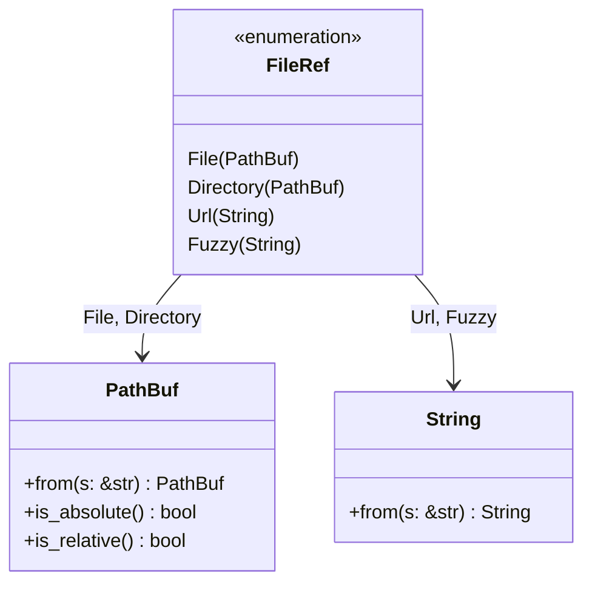

# FileRef

**Type:** technology

### From: parse

The `FileRef` enum constitutes the type system foundation for reference classification within the ragent-core parser, establishing a four-variant taxonomy that distinguishes different categories of user-specified resources. As a public enum with full trait derivations (`Debug`, `Clone`, `PartialEq`, `Eq`), it serves as both an internal implementation detail and an API contract for consumers of the parsing module. Each variant carries appropriate data: `File` and `Directory` wrap `PathBuf` for filesystem operations, `Url` contains a `String` for web addresses, and `Fuzzy` holds a `String` for pattern-matching against project symbols.

The design reflects careful consideration of Rust's type safety and memory efficiency. Using `PathBuf` rather than raw strings for path variants ensures proper cross-platform path handling and prevents path injection vulnerabilities. The `Url` variant's string storage (rather than a dedicated URL type) suggests a design decision to defer full URL parsing and validation to downstream consumers, keeping the reference parser focused on detection and basic classification. The `Fuzzy` variant acknowledges that users may reference entities by approximate or incomplete names, requiring more sophisticated resolution strategies such as fuzzy string matching against filenames or symbol tables.

This enum enables exhaustive pattern matching throughout the codebase, ensuring that all reference types receive appropriate handling. The classification hierarchy implemented in `classify_ref` prioritizes specificity: URLs are most specific due to their protocol scheme, followed by directories with their trailing slash convention, then explicit file paths with separators or extensions, with fuzzy matching as the fallback. This prioritization prevents misclassification—ensuring that `https://example.com/file.txt` becomes a `Url` rather than a `File`, and that `src/` becomes a `Directory` rather than a `File`.

## Diagram

## External Resources

- [Rust PathBuf documentation for cross-platform path handling](https://doc.rust-lang.org/std/path/struct.PathBuf.html) - Rust PathBuf documentation for cross-platform path handling
- [Rust pattern matching and enums guide](https://doc.rust-lang.org/book/ch06-02-match.html) - Rust pattern matching and enums guide
- [Rust API guidelines for type safety](https://rust-lang.github.io/api-guidelines/type-safety.html) - Rust API guidelines for type safety

## Sources

- [parse](../sources/parse.md)
