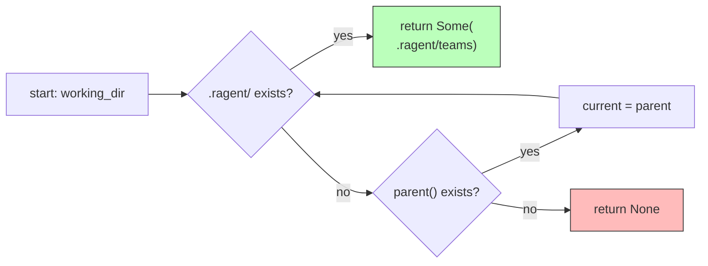

# find_project_teams_dir

**Type:** technology

### From: store

The `find_project_teams_dir` function implements a directory traversal algorithm to discover project-local team storage locations within the RAgent system. Starting from a specified working directory, the function walks upward through the filesystem hierarchy, checking each ancestor directory for the presence of a `.ragent/` subdirectory. This bottom-up search enables teams to be associated with specific codebases or projects, with the discovered path constructed as `[PROJECT]/.ragent/teams/` to maintain organizational separation between different software projects.

The implementation uses a loop-based traversal rather than recursion, making it suitable for deeply nested directory structures without risking stack overflow. The function returns `Option<PathBuf>`, communicating the possibility that no project-local configuration exists in the ancestor chain. This design supports flexible deployment scenarios where RAgent can operate in both project-scoped and global modes depending on the detected environment. The traversal terminates at the filesystem root (when `parent()` returns `None`), providing bounded execution time regardless of directory depth.

This discovery mechanism establishes the foundation for RAgent's hierarchical configuration precedence, where project-local teams override global teams of the same name. The function integrates with `find_team_dir` and `TeamStore::create` to enable context-aware team resolution, allowing developers to maintain project-specific agent teams that travel with their repositories while still accessing personal global configurations when working outside defined project scopes.

## Diagram

## External Resources

- [Rust Path API documentation for filesystem path manipulation](https://doc.rust-lang.org/std/path/struct.Path.html) - Rust Path API documentation for filesystem path manipulation
- [Filesystem Hierarchy Standard conventions](https://en.wikipedia.org/wiki/Filesystem_hierarchy_standard) - Filesystem Hierarchy Standard conventions

## Sources

- [store](../sources/store.md)
