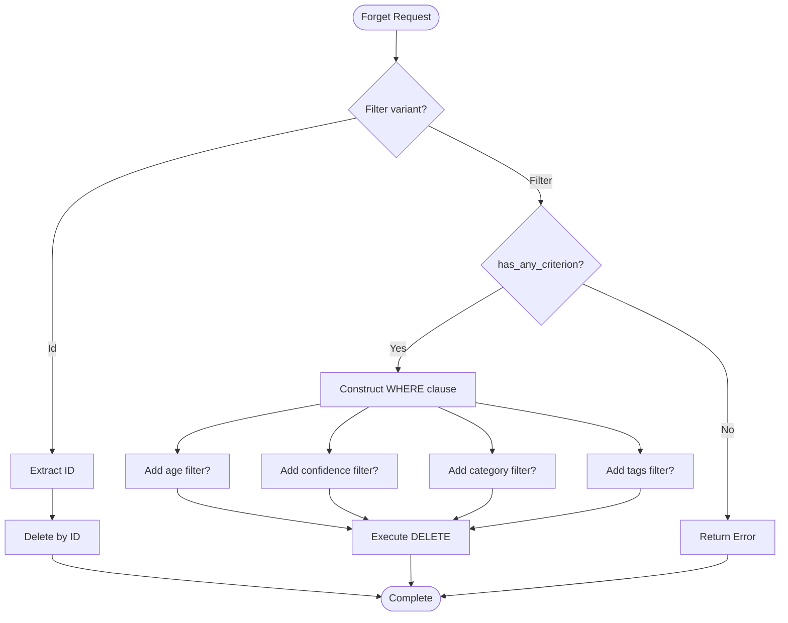

# ForgetFilter

**Type:** technology

### From: store

ForgetFilter is a Rust enum implementing sophisticated deletion semantics for the ragent memory system's garbage collection and management capabilities. The type represents two distinct deletion strategies: precise single-record removal via Id(i64) for targeted forgetting, and broad predicate-based cleanup through the Filter struct variant supporting compound criteria. This dual-mode design accommodates both user-initiated specific deletions and automated maintenance operations like purging stale or low-confidence memories.

The Filter variant's fields implement conjunctive semantics—age thresholds (older_than_days), confidence ceilings (max_confidence), categorical restriction, and tag-based intersection—enabling expressive queries like "delete workflow memories older than 90 days with confidence below 0.3." The Option-wrapped fields support partial specification, with has_any_criterion providing runtime validation that prevents accidental unbounded deletions by ensuring at least one constraint is present. Special handling for empty tag vectors prevents semantic confusion where Some(vec![]) would otherwise appear as a criterion.

The implementation reflects lessons from database query design and safe deletion practices. By requiring explicit criterion presence checking, the API prevents catastrophic data loss from empty filter constructions. The enum structure leverages Rust's algebraic data types to encode mutually exclusive strategies—one cannot simultaneously specify an ID and filter criteria—while maintaining serialization compatibility through derive macros. Integration with the memory_forget tool occurs through JSON deserialization, with the has_any_criterion method enabling early validation before expensive storage operations.

## Diagram

## External Resources

- [Rust enum patterns and algebraic data types](https://doc.rust-lang.org/book/ch06-01-defining-an-enum.html) - Rust enum patterns and algebraic data types
- [Database conjunctive query semantics](https://en.wikipedia.org/wiki/Conjunctive_query) - Database conjunctive query semantics

## Sources

- [store](../sources/store.md)
