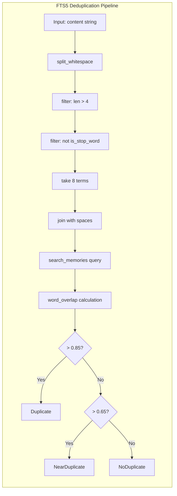

# FTS5

**Type:** technology

### From: compact

FTS5 (Full-Text Search version 5) is a SQLite extension module that provides comprehensive full-text search capabilities, serving as the fallback deduplication mechanism when vector embeddings are unavailable. The ragent system leverages FTS5's built-in tokenization and matching algorithms to identify potentially duplicate memories based on keyword overlap, extracting significant terms from proposed memory content while filtering out common stop words. The implementation specifically selects words longer than four characters that don't appear in a curated stop word list, taking up to eight terms to construct a search query that balances specificity with recall. While less semantically sophisticated than cosine similarity on embeddings, this approach provides deterministic behavior without external dependencies and performs well for exact or near-exact textual matches. The word_overlap function computes a normalized intersection ratio between candidate memories, establishing similarity thresholds that parallel the embedding-based strategy for consistent user experience across configuration variants. FTS5's integration with SQLite eliminates network overhead and reduces operational complexity compared to external search services.

## Diagram

## External Resources

- [Official SQLite FTS5 documentation and feature reference](https://www.sqlite.org/fts5.html) - Official SQLite FTS5 documentation and feature reference
- [SQLite tokenizer documentation for understanding term extraction behavior](https://www.sqlite.org/fts3.html#tokenizer) - SQLite tokenizer documentation for understanding term extraction behavior

## Sources

- [compact](../sources/compact.md)
