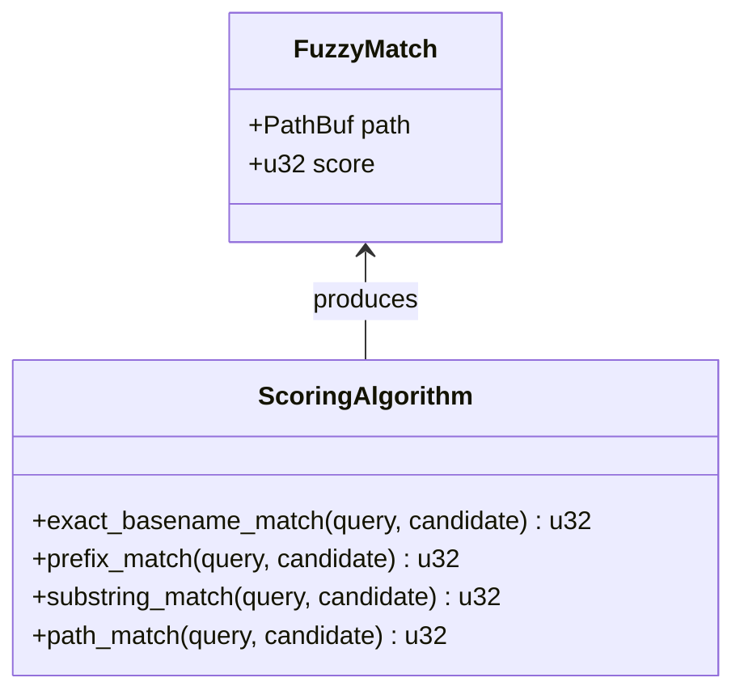

# FuzzyMatch

**Type:** product

### From: fuzzy

FuzzyMatch is a data structure and associated algorithm implementation designed for intelligent file path matching in code editor environments. The product consists of a scoring system that evaluates how well a file path matches a user's query string, returning ranked results suitable for autocompletion interfaces. It is specifically optimized for the common developer workflow of typing partial filenames or path fragments to quickly navigate to target files.

The scoring algorithm implements a four-tier priority system that reflects how developers typically think about file locations. An exact basename match (score 100) indicates the user typed the complete filename, while a prefix match (score 75) suggests they're typing from the beginning of a name they remember. Substring matches within the basename (score 50) accommodate cases where the user remembers a distinctive middle portion of a filename, and path-level matches (score 25) handle scenarios where the query appears only in directory names. This graduated scoring ensures intuitive result ordering that aligns with user expectations.

The implementation includes practical optimizations for real-world usage including a 10,000 file limit to maintain responsiveness in large monorepos, case-insensitive matching to accommodate varying conventions, and special handling for directory entries marked with trailing slashes. The tiebreaker logic that prefers shorter paths when scores are equal further improves usability by surfacing less nested files first, as these are often the primary entry points developers seek.

## Diagram

## External Resources

- [Wikipedia article on approximate string matching (fuzzy matching)](https://en.wikipedia.org/wiki/Approximate_string_matching) - Wikipedia article on approximate string matching (fuzzy matching)
- [fzf - A popular command-line fuzzy finder with similar matching concepts](https://github.com/junegunn/fzf) - fzf - A popular command-line fuzzy finder with similar matching concepts

## Sources

- [fuzzy](../sources/fuzzy.md)
