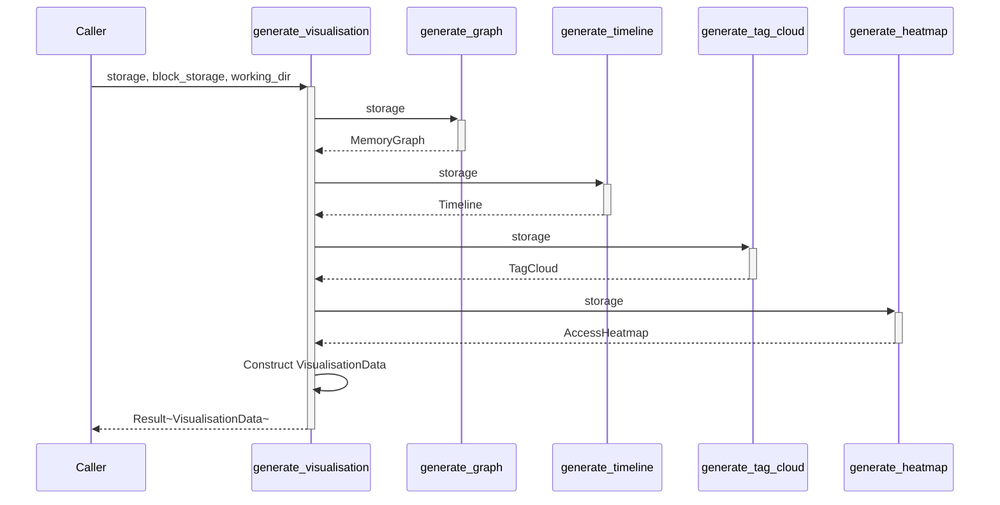

# generate_visualisation

**Type:** technology

### From: visualisation

The generate_visualisation function serves as the primary orchestration entry point for producing comprehensive memory visualisation data, coordinating the execution of four specialized generation subroutines and aggregating their results into a unified VisualisationData bundle. The function accepts three parameters: a reference to the SQLite-backed Storage implementation for structured data queries, a trait object reference to BlockStorage for potential future file-based content retrieval, and the project working directory path for relative path resolution. The block_storage and working_dir parameters are currently prefixed with underscores indicating intentional non-use, suggesting a placeholder API designed for anticipated functionality not yet implemented—likely large content retrieval or attachment handling that would require filesystem access.

The implementation demonstrates sequential error propagation using the question mark operator, where any failure in graph, timeline, tag cloud, or heatmap generation immediately short-circuits the entire operation. This fail-fast behavior ensures data consistency within the bundled response at the cost of all-or-nothing availability. The four generation calls exhibit no interdependencies, suggesting potential for parallel execution via join! or similar async combinators in future async refactorings, though the current synchronous implementation prioritizes simplicity. The returned VisualisationData struct construction uses Rust's struct literal shorthand for identically-named bindings, a concise syntax reducing repetition.

Function signature design reveals architectural decisions about abstraction boundaries. The Storage parameter uses a concrete reference type rather than a trait object, indicating a single supported backend implementation (SQLite) with compile-time dispatch. Conversely, BlockStorage accepts &dyn BlockStorage, enabling runtime polymorphism for potentially multiple file storage backends—perhaps local filesystem, object storage, or network-attached variants. This asymmetry suggests the storage abstraction matured at different rates, with structured data (Storage) being more stabilized than unstructured block content. The anyhow::Result return type provides ergonomic error handling with automatic context propagation, appropriate for a high-level orchestration function where specific error variants matter less than failure indication.

## Diagram

## External Resources

- [Anyhow error handling library for Rust](https://docs.rs/anyhow/latest/anyhow/) - Anyhow error handling library for Rust
- [Rust error propagation with the question mark operator](https://doc.rust-lang.org/rust-by-example/error/result/question_mark.html) - Rust error propagation with the question mark operator

## Sources

- [visualisation](../sources/visualisation.md)
