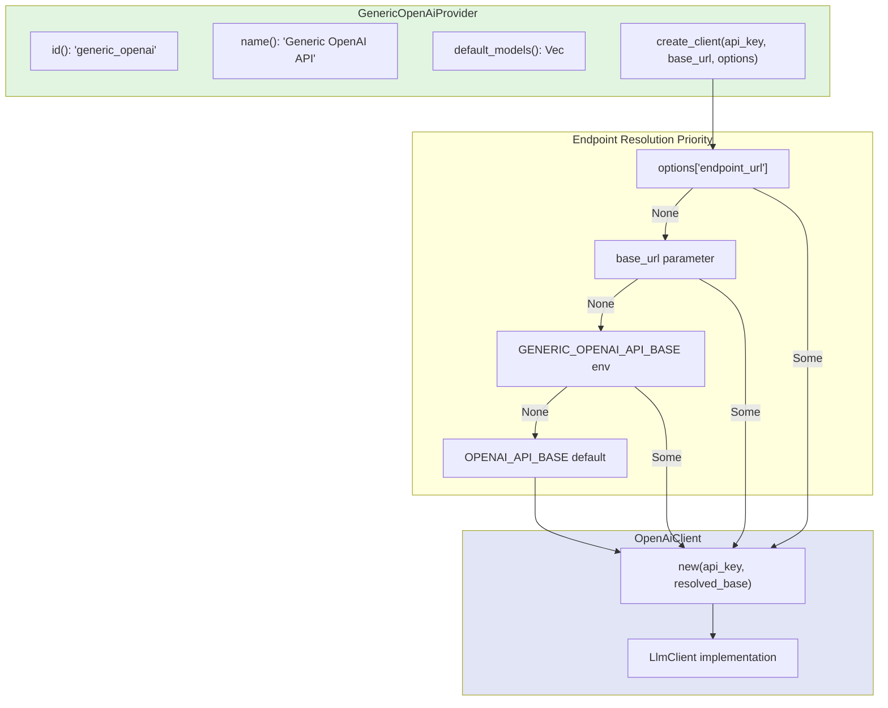

# GenericOpenAiProvider

**Type:** technology

### From: generic_openai

The `GenericOpenAiProvider` is a Rust struct that implements the `Provider` trait to enable connections to arbitrary OpenAI-compatible API endpoints. Unlike the standard OpenAI provider that connects exclusively to OpenAI's official API, this implementation adds flexibility through configurable base URLs while maintaining full protocol compatibility. The struct itself is a zero-sized type (unit struct) containing no fields, with all configuration handled through method parameters, environment variables, and options maps at client creation time.

The provider's architecture separates concerns effectively: the `GenericOpenAiProvider` handles endpoint resolution and client instantiation, while delegating actual API communication to the existing `OpenAiClient`. This composition pattern allows code reuse without duplication of HTTP handling, authentication, and response parsing logic. The implementation supports multiple endpoint resolution strategies with clear priority ordering, making it suitable for diverse deployment scenarios from local development to production environments with custom infrastructure.

The provider exposes two configuration constants: `ENDPOINT_OPTION_KEY` ("endpoint_url") for explicit programmatic configuration, and `DEFAULT_ENV_ENDPOINT_KEY` ("GENERIC_OPENAI_API_BASE") for environment-based configuration. This dual approach follows twelve-factor app principles, allowing configuration through both code and environment. The provider is particularly valuable for organizations running self-hosted language models via tools like Ollama, LocalAI, or vLLM, as well as those using proxy services or alternative providers like Together AI, Replicate, or custom corporate AI gateways that expose OpenAI-compatible interfaces.

## Diagram

## External Resources

- [OpenAI Chat Completions API specification that compatible endpoints must implement](https://platform.openai.com/docs/api-reference/chat) - OpenAI Chat Completions API specification that compatible endpoints must implement
- [Ollama's OpenAI-compatible API documentation for self-hosted models](https://github.com/ollama/ollama/blob/main/docs/openai.md) - Ollama's OpenAI-compatible API documentation for self-hosted models
- [LocalAI - OpenAI-compatible API for local model inference](https://github.com/mudler/LocalAI) - LocalAI - OpenAI-compatible API for local model inference
- [Twelve-Factor App methodology on configuration management](https://12factor.net/config) - Twelve-Factor App methodology on configuration management

## Sources

- [generic_openai](../sources/generic-openai.md)
