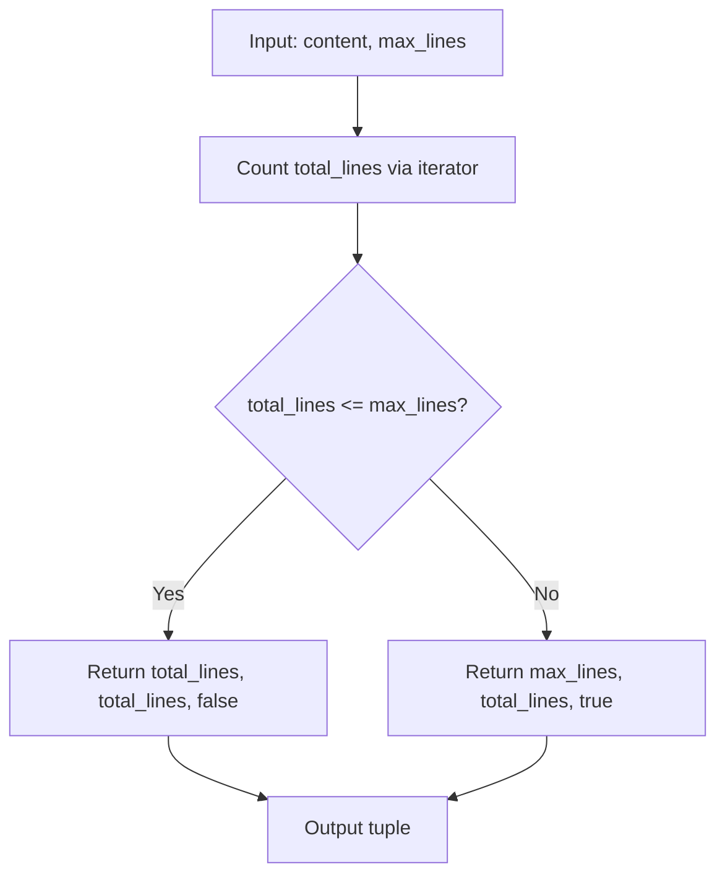

# get_truncation_stats

**Type:** technology

### From: truncate

The `get_truncation_stats` function provides a metadata-only alternative to truncation operations, returning a tuple containing the number of lines that would be displayed, the total line count, and a boolean indicating whether truncation would occur. This utility enables upstream code to make informed decisions about content handling without the cost of actual string manipulation, supporting use cases such as progress reporting, UI preview calculations, and conditional processing pipelines. The function's return type `(usize, usize, bool)` follows Rust conventions for statistical queries, with the first element representing displayed lines (equal to total when no truncation needed, equal to max_lines when truncation occurs), the second providing the complete line count, and the third offering a convenient boolean for conditional logic. The implementation leverages `lines().count()` for efficient line enumeration without materializing intermediate collections, distinguishing it from the sibling truncation functions that require vector allocation for slice operations. This design enables lightweight preview functionality where an agent system might query truncation statistics before deciding whether to apply truncation, stream to a pager, or process content through alternative pathways.

## Diagram

## External Resources

- [Iterator::count documentation for understanding line enumeration efficiency](https://doc.rust-lang.org/std/iter/trait.Iterator.html#method.count) - Iterator::count documentation for understanding line enumeration efficiency
- [Rust API Guidelines on type safety and tuple return patterns](https://rust-lang.github.io/api-guidelines/type-safety.html) - Rust API Guidelines on type safety and tuple return patterns

## Sources

- [truncate](../sources/truncate.md)
