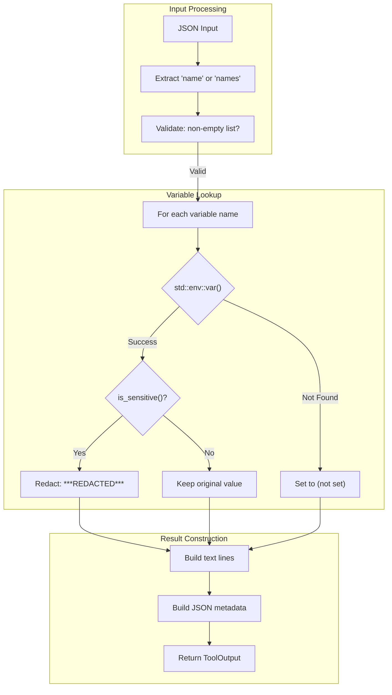

# GetEnvTool

**Type:** technology

### From: get_env

GetEnvTool is a Rust struct that implements a secure environment variable reading capability for AI agent systems. The tool serves as a bridge between AI agents and the host operating system's environment, providing controlled access to configuration data while implementing automatic redaction of sensitive values. Its design follows the principle of least privilege by allowing agents to query environment state without exposing credentials that could be misused if leaked through logs, error messages, or model outputs.

The implementation leverages Rust's type system and ownership model to ensure memory safety and prevent common vulnerabilities. It uses the `async_trait` crate to define asynchronous behavior, enabling non-blocking execution within larger agent workflows. The tool's architecture separates concerns cleanly: pattern matching for sensitivity detection is isolated in the `is_sensitive` function, parameter parsing handles both single values and arrays, and the execution logic manages error cases for unset variables gracefully.

Historically, tools like GetEnvTool emerged from the growing need to safely integrate large language models with system resources. Early AI agent frameworks often struggled with the "prompt injection" problem, where malicious inputs could trick models into revealing secrets. By implementing redaction at the tool layer rather than relying on model behavior, GetEnvTool provides a deterministic security boundary. The specific patterns chosen (`KEY`, `SECRET`, `TOKEN`, `PASSWORD`, `PASS`, `CREDENTIAL`) reflect decades of industry convention in naming sensitive configuration values across cloud platforms, databases, and authentication systems.

The tool's integration into the broader `ragent-core` framework suggests it is part of a modular tool ecosystem where agents can be granted specific capabilities through composition. The `permission_category` method returning `"file:read"` indicates alignment with capability-based security models, even though environment variables are not technically files. This categorization likely reflects an abstraction where read operations on system state are grouped together for permission management purposes, simplifying policy definition for agent operators.

## Diagram

## External Resources

- [async-trait crate documentation for Rust async trait implementation](https://docs.rs/async-trait/latest/async_trait/) - async-trait crate documentation for Rust async trait implementation
- [Serde serialization framework used for JSON handling](https://serde.rs/) - Serde serialization framework used for JSON handling
- [OWASP Top 10 security risks including sensitive data exposure](https://owasp.org/www-project-top-ten/) - OWASP Top 10 security risks including sensitive data exposure

## Sources

- [get_env](../sources/get-env.md)
