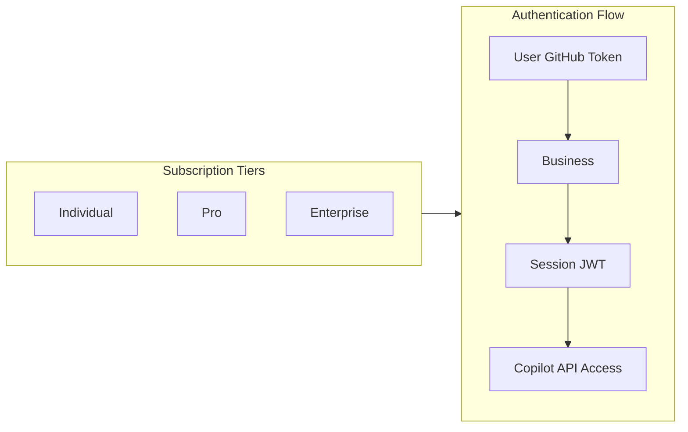

# GitHub Copilot

**Type:** product

### From: copilot

GitHub Copilot is an AI pair programmer powered by OpenAI Codex and other large language models, launched by GitHub in June 2021 and made generally available in 2022. It represents one of the most widely deployed AI coding assistants in the software development industry, integrated directly into editors like VS Code, Visual Studio, Neovim, and JetBrains IDEs. The product has evolved significantly from its initial code completion focus to encompass chat-based interactions, multi-file editing, and agentic capabilities through its integration with the broader GitHub ecosystem.

The technical architecture of Copilot is particularly noteworthy for its sophisticated authentication and routing system. Unlike simpler API-based services, Copilot employs a tiered authentication model where users authenticate with GitHub credentials, but API access requires exchanging those credentials for short-lived session tokens through an internal GitHub API. This design reflects GitHub's need to manage access across multiple subscription tiers (Individual, Pro, Business, Enterprise) while maintaining security boundaries. The Copilot API itself exposes an OpenAI-compatible interface, allowing third-party tools to leverage the same models and capabilities available through official integrations.

Copilot's model offerings have expanded considerably since launch. While initially based primarily on Codex models, the service now provides access to GPT-4o, GPT-4o-mini, Claude Sonnet, and OpenAI's reasoning models like o3-mini. Each model carries different capability profiles—some support vision (multimodal inputs), some support tool use, and reasoning models like o3-mini support configurable reasoning effort levels. The service pricing varies by tier, with individual subscriptions typically around $10/month and enterprise pricing negotiated at scale. The implementation in ragent-core must navigate this complexity to present a unified interface to consuming applications.

## Diagram

## External Resources

- [Official GitHub Copilot product page with pricing and feature overview](https://github.com/features/copilot) - Official GitHub Copilot product page with pricing and feature overview
- [GitHub Copilot documentation including API references and authentication guides](https://docs.github.com/en/copilot) - GitHub Copilot documentation including API references and authentication guides

## Sources

- [copilot](../sources/copilot.md)
