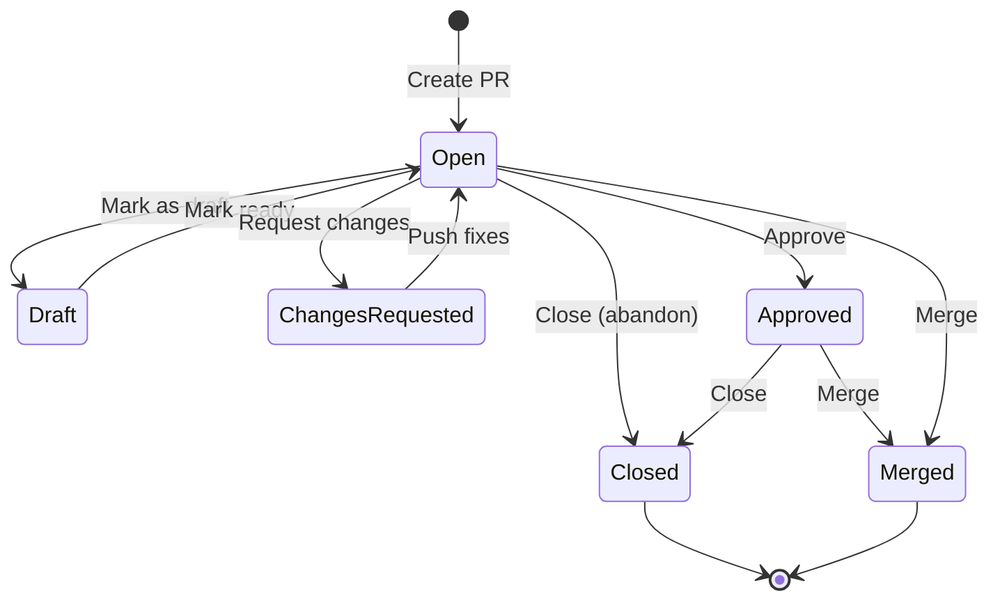

# GitHub Pull Request

**Type:** product

### From: github_prs

The GitHub Pull Request is a collaborative code review and integration feature that has fundamentally transformed how software teams work together. Introduced by GitHub in 2008, pull requests provide a structured workflow for proposing, discussing, and merging code changes. A pull request represents a request to merge code from one branch (the head branch) into another (the base branch), accompanied by a description, discussion thread, and review mechanism.

The pull request workflow typically involves several stages: a developer creates a branch, makes commits, pushes the branch to the remote repository, then opens a pull request. Team members can then review the proposed changes, leave comments on specific lines, request modifications, and ultimately approve or reject the contribution. This process enables asynchronous collaboration, quality assurance through peer review, and continuous integration through automated checks. The tools in this Rust implementation expose all these capabilities programmatically.

GitHub has continuously evolved the pull request feature, adding capabilities like draft pull requests for work-in-progress, code owners for automatic reviewer assignment, merge queues for complex branch protection rules, and suggested changes for direct modification proposals. The REST API endpoints used in this implementation—`/repos/{owner}/{repo}/pulls` and related paths—provide access to these features, enabling the creation of sophisticated automation and tooling. Pull requests have become so central to modern development that 'PR-driven development' describes workflows where most engineering communication and decision-making happens within pull request contexts.

## Diagram

## External Resources

- [GitHub Pull Requests documentation](https://docs.github.com/en/pull-requests) - GitHub Pull Requests documentation
- [Recent improvements to GitHub Pull Requests](https://github.blog/2022-06-30-improvements-to-the-pull-request-experience/) - Recent improvements to GitHub Pull Requests

## Sources

- [github_prs](../sources/github-prs.md)
