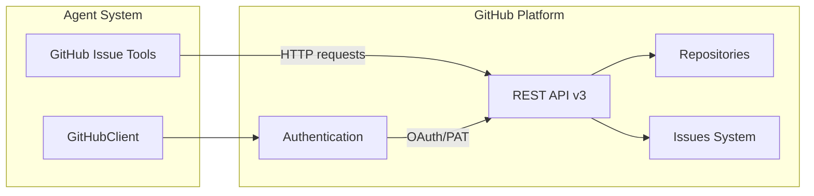

# GitHub

**Type:** organization

### From: github_issues

GitHub is the world's leading platform for software development and version control, founded in 2008 by Tom Preston-Werner, Chris Wanstrath, PJ Hyett, and Scott Chacon, and acquired by Microsoft in 2018 for $7.5 billion. The platform revolutionized collaborative software development through its implementation of Git repositories combined with social coding features, issue tracking, pull requests, and project management tools. GitHub hosts over 100 million repositories and serves more than 100 million developers globally, making it the largest host of source code in history. The GitHub Issues system, which this code integrates with, emerged as one of the platform's core features, transforming how development teams track bugs, manage feature requests, and coordinate work across distributed teams.

The GitHub REST API v3, which this implementation consumes, provides programmatic access to nearly all GitHub features through a well-documented HTTP-based interface. The API follows RESTful principles with resource-oriented URLs, standard HTTP verbs, and JSON responses, enabling developers to build integrations, automation tools, and third-party applications. GitHub's API authentication supports multiple methods including personal access tokens, GitHub Apps, and OAuth applications, with fine-grained permission scopes that this code leverages through its "github:read" and "github:write" categorization. The API's rate limiting and pagination mechanisms require careful handling, as demonstrated in this implementation's use of per_page parameters and result limit enforcement.

GitHub's impact on open source software cannot be overstated—it catalyzed the growth of collaborative development by lowering barriers to contribution and creating social networks around code. The Issues feature specifically transformed bug tracking from cumbersome standalone systems into integrated, conversational workflows where technical discussion happens alongside code. GitHub Issues supports rich metadata including labels, milestones, assignees, and projects, all of which this tool implementation interacts with. The platform's continued evolution includes GitHub Actions for CI/CD, GitHub Copilot for AI-assisted coding, and advanced security features, maintaining its position as the central hub of modern software development.

## Diagram

## External Resources

- [GitHub REST API documentation](https://docs.github.com/en/rest) - GitHub REST API documentation
- [Official GitHub blog for product updates](https://github.blog/) - Official GitHub blog for product updates

## Sources

- [github_issues](../sources/github-issues.md)

### From: github_prs

GitHub is a web-based platform for version control and collaborative software development founded in 2008 by Tom Preston-Werner, Chris Wanstrath, PJ Hyett, and Scott Chacon. It has grown to become the world's largest host of source code, with over 100 million developers and 400 million repositories as of 2023. GitHub provides Git repository hosting plus additional features like pull requests, issue tracking, project management tools, and GitHub Actions for CI/CD workflows.

The platform's pull request mechanism, which these Rust tools interface with, represents one of GitHub's most significant contributions to collaborative software development. Pull requests enable developers to propose changes, request code reviews, discuss implementations, and merge contributions through a structured web interface. This workflow has become the de facto standard for open-source collaboration and enterprise code review processes, replacing older patch-based contribution models.

GitHub was acquired by Microsoft in 2018 for $7.5 billion, marking one of the largest acquisitions in the technology sector. Under Microsoft ownership, GitHub has expanded its AI-powered features significantly, including GitHub Copilot for AI-assisted coding and GitHub Advanced Security for vulnerability detection. The platform's REST API, which these tools consume, provides comprehensive programmatic access to nearly all GitHub features, enabling third-party integrations and automation workflows like the one implemented in this Rust codebase.
