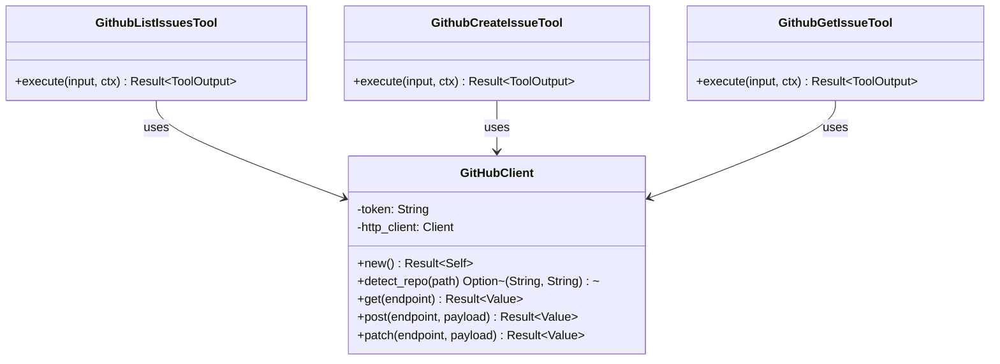

# GitHubClient

**Type:** technology

### From: github_issues

GitHubClient is a custom HTTP client abstraction within this Rust codebase that encapsulates authentication management, request construction, and response handling for the GitHub REST API. The client serves as the foundational infrastructure layer that all GitHub issue tools depend upon, providing a clean interface for making authenticated GET, POST, and PATCH requests to GitHub's API endpoints. The implementation follows the builder pattern and RAII (Resource Acquisition Is Initialization) principles common in Rust, with the new() constructor handling credential discovery from environment variables or configuration files, and returning a Result that propagates authentication errors with contextual messages guiding users to run "/github login".

The GitHubClient abstraction demonstrates several important software engineering principles. It centralizes cross-cutting concerns like authentication headers, base URL management, and error handling, preventing duplication across the five tool implementations. The detect_repo() method showcases sophisticated environment awareness, examining the git working directory to extract remote URL information and parse owner/repository tuples automatically. This eliminates manual configuration for the common case where agents operate within cloned repositories, while still supporting explicit overrides when needed. The client's methods likely return serde_json::Value types for flexible JSON processing, allowing each tool to extract only the fields it needs without rigid struct definitions for every API response variant.

The HTTP method abstractions—get(), post(), and patch()—mirror REST semantics while handling GitHub-specific concerns like pagination, rate limit headers, and error response parsing. The client implementation would manage connection pooling through underlying HTTP libraries like reqwest or hyper, leveraging Rust's async runtime for efficient concurrent operations. Authentication state management is particularly critical, as the client must securely handle personal access tokens or OAuth tokens, refreshing them when necessary and failing gracefully with actionable error messages when credentials expire or lack required scopes. This abstraction layer enables the tool implementations to focus on business logic—filtering issues, formatting output, constructing payloads—while delegating all network concerns to the specialized client.

## Diagram

## External Resources

- [GitHub API authentication guide](https://docs.github.com/en/rest/authentication) - GitHub API authentication guide
- [reqwest HTTP client library documentation](https://docs.rs/reqwest/latest/reqwest/) - reqwest HTTP client library documentation

## Sources

- [github_issues](../sources/github-issues.md)

### From: mod

GitHubClient is the primary API client struct exposed by the ragent-core GitHub module, designed to facilitate authenticated HTTP communication with GitHub's REST and GraphQL APIs. This client abstraction encapsulates the complexity of API authentication, request construction, response parsing, and error handling, providing a type-safe Rust interface for GitHub operations. The client likely implements methods for common GitHub operations such as repository management, issue tracking, pull request handling, and workflow automation.

The design of GitHubClient follows Rust's ownership and borrowing patterns, potentially supporting both synchronous and asynchronous execution contexts through integration with Tokio or similar async runtimes. Authentication state is managed internally, with the client receiving a resolved token from the auth module's resolution chain. This separation of concerns—where authentication logic resides in the `auth` submodule while request execution lives in `client`—enables better testability and allows for different authentication strategies without changing the core client implementation.

In the broader context of the ragent project, GitHubClient serves as a critical infrastructure component that enables agent capabilities to interact with software development workflows. Agents built on ragent can programmatically create issues, review pull requests, trigger CI/CD pipelines, manage releases, and access repository metadata. The client may also implement features like automatic rate limit handling, request retries with exponential backoff, and pagination support for large result sets—essential features for reliable automation against GitHub's API, which imposes strict rate limits (typically 5000 requests per hour for authenticated users).
