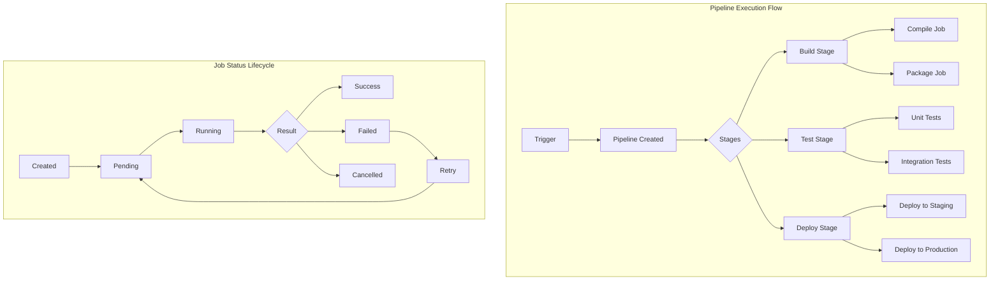

# GitLab CI/CD

**Type:** technology

### From: gitlab_pipelines

GitLab CI/CD is a continuous integration and continuous deployment platform integrated into GitLab's DevOps lifecycle. It enables automated building, testing, and deployment of software through pipelines defined in .gitlab-ci.yml files. The platform operates on a runner-based architecture where jobs are executed on registered runners, supporting multiple execution environments including Docker, Kubernetes, and shell executors.

The CI/CD system organizes work into pipelines, which contain stages (like build, test, deploy), which in turn contain individual jobs. Each job runs in an isolated environment and can produce artifacts, capture logs, and report status back to the GitLab instance. The platform supports complex workflows including manual gates, parallel execution, job dependencies through needs, and pipeline triggers. GitLab CI/CD has evolved from a simple CI tool into a comprehensive DevOps platform competing with Jenkins, CircleCI, and GitHub Actions.

The API exposed by GitLab for CI/CD operations follows REST principles and provides endpoints for pipeline orchestration, job management, artifact handling, and log retrieval. Authentication uses personal or project access tokens with fine-grained scopes. The API versioning and stability guarantees have made it a reliable integration target for third-party tools and automation platforms.

## Diagram

## External Resources

- [Official GitLab CI/CD documentation covering pipeline configuration and concepts](https://docs.gitlab.com/ee/ci/) - Official GitLab CI/CD documentation covering pipeline configuration and concepts
- [GitLab Pipelines API reference documentation](https://docs.gitlab.com/ee/api/pipelines.html) - GitLab Pipelines API reference documentation
- [GitLab Jobs API reference documentation](https://docs.gitlab.com/ee/api/jobs.html) - GitLab Jobs API reference documentation

## Sources

- [gitlab_pipelines](../sources/gitlab-pipelines.md)
