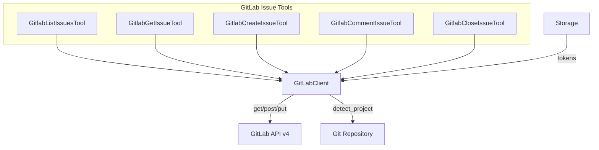

# GitLabClient

**Type:** technology

### From: gitlab_issues

GitLabClient represents a custom Rust abstraction encapsulating HTTP communication with GitLab's REST API, authentication management, and response parsing logic. This client implementation serves as the foundational dependency for all GitLab-related tools in the agent framework, providing methods for GET, POST, and PUT HTTP operations against the GitLab API v4 endpoints. The client manages authentication state through a storage abstraction, likely implementing OAuth2 token refresh flows or personal access token persistence to maintain authenticated sessions across tool invocations.

The client's design emphasizes reusability and testability through dependency injection patterns. The detect_project method implements intelligent project resolution by analyzing git remote configurations in the working directory, automatically extracting URL-encoded project paths from GitLab remote URLs. This automation eliminates manual configuration requirements and enables seamless context-aware tool execution. The client likely implements retry logic, rate limiting awareness, and comprehensive error mapping from HTTP status codes to domain-specific error types.

The GitLabClient abstraction demonstrates sophisticated Rust patterns including the use of async methods for non-blocking I/O, Result types for explicit error propagation, and generic storage backends for flexible deployment configurations. The client's integration with the anyhow ecosystem suggests comprehensive error context chaining, enabling developers to trace failure paths from API errors through to user-facing messages. This abstraction layer isolates the tool implementations from direct HTTP client concerns, enabling future migrations to GraphQL or alternative transport mechanisms without tool-level modifications.

## Diagram

## External Resources

- [GitLab REST API overview and authentication](https://docs.gitlab.com/ee/api/rest/) - GitLab REST API overview and authentication

## Sources

- [gitlab_issues](../sources/gitlab-issues.md)

### From: gitlab_mrs

GitLabClient is a Rust abstraction layer that encapsulates authentication, request building, and response handling for interactions with the GitLab REST API. This client serves as the foundational component enabling all GitLab-related tools in the agent system, providing methods for HTTP GET, POST, and PUT operations against GitLab's API endpoints. The client manages authentication tokens retrieved from secure storage, handles URL encoding of project paths (which in GitLab use URL-encoded namespace/project syntax), and provides standardized error handling for API failures. The implementation likely includes request timeout handling, retry logic for transient failures, and proper header management for authentication and content type negotiation.

A critical capability of GitLabClient is the detect_project() method, which implements intelligent project discovery by analyzing the git remote configuration of the local repository. This method parses remote URLs to extract the GitLab namespace and project name, handling various URL formats including HTTPS and SSH remotes. For instance, it can extract "mygroup/myproject" from both "https://gitlab.com/mygroup/myproject.git" and "git@gitlab.com:mygroup/myproject.git" formats. This automatic detection eliminates the need for users to manually specify project identifiers, creating a seamless experience when working across multiple repositories.

The client architecture demonstrates separation of concerns by isolating GitLab-specific API knowledge from the tool implementations. Tools interact with GitLabClient through semantic methods rather than constructing raw HTTP requests, making the codebase more maintainable and testable. The client also likely implements rate limiting awareness and pagination handling for endpoints returning large result sets, though the current tool implementations handle pagination parameters explicitly through the limit parameter in listing operations.

### From: gitlab_pipelines

GitLabClient is a Rust abstraction layer for authenticating with and communicating to GitLab API instances. The client encapsulates the complexity of GitLab API interactions including token management, request construction, response parsing, and error handling. It supports both cloud-hosted GitLab.com and self-managed GitLab instances through configurable instance URLs. The client is designed to be instantiated with a storage backend that securely retains authentication credentials.

A distinctive capability of GitLabClient is automatic project detection from local git repositories. The detect_project method analyzes git remotes in the working directory to identify the corresponding GitLab project path, eliminating manual configuration for common development workflows. This feature enables seamless CLI experiences where tools automatically understand their context without explicit project identifiers. The client handles the URL-encoded project path format required by GitLab's API, which uses percent-encoding for namespace/project combinations.

The client provides generic HTTP methods (get, post) that handle authentication headers, base URL resolution, and response transformation into serde_json::Value types. It abstracts the underlying HTTP client (likely reqwest) while exposing a domain-specific interface for GitLab operations. Error handling propagates HTTP status codes and API error responses into descriptive anyhow errors, maintaining the diagnostic information needed for troubleshooting integration issues.
