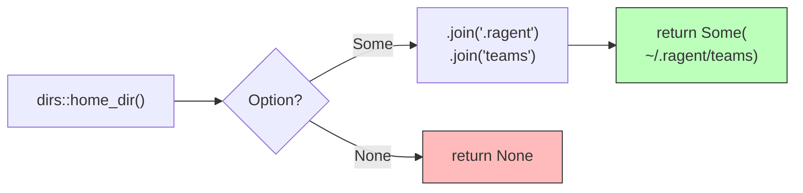

# global_teams_dir

**Type:** technology

### From: store

The `global_teams_dir` function provides access to the user-global team storage location, returning `~/.ragent/teams/` as a platform-agnostic `PathBuf`. This function leverages the `dirs` crate (specifically `dirs::home_dir()`) to determine the user's home directory across different operating systems, handling platform variations such as Windows (`%USERPROFILE%`), macOS (`/Users/username`), and Linux (`/home/username`). The use of the `dirs` crate abstracts away environment variable lookup and platform-specific home directory resolution logic.

The function returns `Option<PathBuf>` rather than panicking when the home directory cannot be determined, enabling graceful degradation in constrained environments such as containers or system accounts without standard home directories. This defensive design allows calling code to make explicit decisions about fallback behavior rather than encountering unexpected panics. The path construction chains `join()` operations to build the complete directory structure, creating `~/.ragent/` as the base configuration directory and `teams/` as the team storage subdirectory.

As the fallback location in RAgent's hierarchical storage model, the global teams directory serves as the default location for teams created without project-local context and provides a personal configuration space that persists across project boundaries. This enables developers to maintain reusable agent teams and configurations that are available regardless of their current working directory, complementing the project-scoped team discovery provided by `find_project_teams_dir`.

## Diagram

## External Resources

- [dirs crate home_dir() documentation](https://docs.rs/dirs/latest/dirs/fn.home_dir.html) - dirs crate home_dir() documentation
- [XDG Base Directory Specification for Linux configuration paths](https://specifications.freedesktop.org/basedir-spec/basedir-spec-latest.html) - XDG Base Directory Specification for Linux configuration paths

## Sources

- [store](../sources/store.md)
