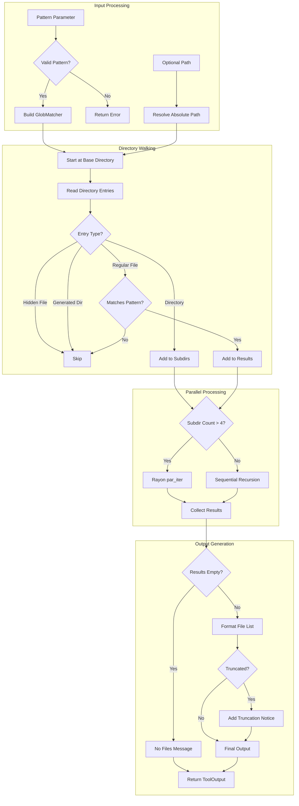

# GlobTool

**Type:** technology

### From: glob

GlobTool is a Rust struct that implements file discovery functionality through glob pattern matching within AI agent systems. The tool serves as a concrete implementation of the `Tool` trait, providing a standardized interface for recursive directory traversal with pattern-based file filtering. Its architecture reflects careful consideration of performance characteristics in real-world codebases, incorporating Rayon-based parallelization when processing directories with more than four subdirectories. The tool's design philosophy emphasizes sensible defaults and safety boundaries, automatically excluding hidden files (those starting with `.`) and common generated directories that typically don't contain source code of interest. These exclusions—`node_modules`, `target`, `__pycache__`, `dist`, and `build`—represent accumulated knowledge about typical development environments across multiple programming languages and build systems. The implementation demonstrates sophisticated error handling strategies, silently skipping IO errors on individual directory entries rather than failing the entire operation, which proves crucial when traversing file systems with varying permission structures or transient states. The 1,000-match limit serves as a protective mechanism against runaway queries that could overwhelm both the system and the consuming AI agent, with explicit truncation signaling in the output. The tool's JSON schema definition enables dynamic parameter validation and UI generation in agent interfaces, specifying required and optional fields with descriptive documentation.

## Diagram

## External Resources

- [globset crate documentation - high-performance glob matching used by GlobTool](https://docs.rs/globset/latest/globset/) - globset crate documentation - high-performance glob matching used by GlobTool
- [Rayon crate documentation - data parallelism library for parallel directory walking](https://docs.rs/rayon/latest/rayon/) - Rayon crate documentation - data parallelism library for parallel directory walking
- [async-trait crate documentation - ergonomic async trait implementations](https://docs.rs/async-trait/latest/async_trait/) - async-trait crate documentation - ergonomic async trait implementations

## Sources

- [glob](../sources/glob.md)
