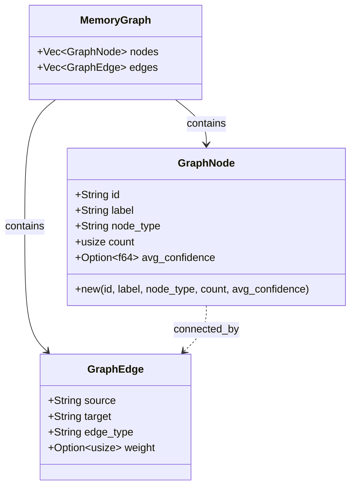

# GraphNode

**Type:** technology

### From: visualisation

GraphNode is a fundamental data structure representing a single node within the memory category graph visualisation system. Each node carries a unique string identifier, a human-readable display label, a categorical type classification (supporting "category", "tag", or "memory" variants), a count of items represented by the node, and an optional average confidence score specifically for memory-type nodes. The struct derives standard Rust traits including Debug for development introspection, Clone for explicit duplication semantics, and both Serialize and Deserialize from the serde crate for seamless JSON interoperability. The avg_confidence field employs serde's skip_serializing_if attribute to omit None values from JSON output, reducing payload size for nodes where confidence scoring is irrelevant.

The node type system enables a heterogeneous graph where distinct semantic entities coexist: category nodes represent broad memory classifications, tag nodes capture cross-cutting topical labels, and memory nodes could represent individual stored memories. The count field serves dual purposes—quantifying either the number of memories within a category or the frequency of tag usage across the memory corpus. This polymorphic design allows the visualisation layer to render a unified graph topology while preserving semantic distinctions through the type discriminator. The prefix convention in id generation ("cat:", "tag:") creates a namespaced identifier system preventing collisions between identically-named categories and tags.

The struct participates in a larger graph construction workflow within the generate_graph function, where nodes are instantiated from filtered memory aggregations. Category nodes receive calculated average confidence through iterator-based summation across matching memories, demonstrating Rust's zero-cost abstractions for numerical computations. The design anticipates graph rendering scenarios where node sizing or coloring might encode confidence metrics, enabling visual prominence cues for high-reliability memory clusters. GraphNode's serialization characteristics make it suitable for direct transmission to web-based visualisation libraries like D3.js or Cytoscape.js, which expect JSON-encoded node-link data formats.

## Diagram

## External Resources

- [Serde field attributes documentation for skip_serializing_if](https://serde.rs/attributes.html) - Serde field attributes documentation for skip_serializing_if
- [Serde serialization framework documentation](https://docs.rs/serde/latest/serde/) - Serde serialization framework documentation

## Sources

- [visualisation](../sources/visualisation.md)
