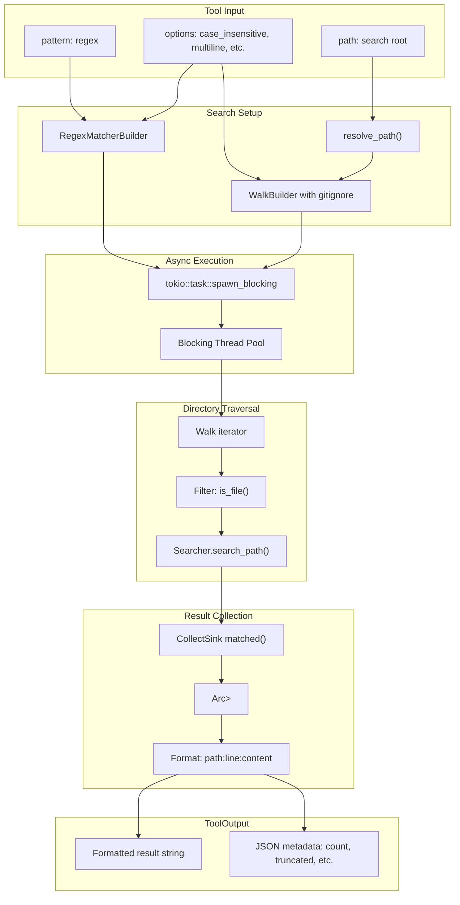

# GrepTool

**Type:** technology

### From: grep

GrepTool is a Rust struct that implements a file content search capability for AI agent systems, wrapping the functionality of the ripgrep library ecosystem. The tool provides a clean interface for searching file contents using regular expressions across directory trees, with built-in support for `.gitignore` handling, automatic binary file detection and skipping, and configurable search parameters. It is designed as an async-friendly component that can be integrated into larger agent frameworks through a trait-based architecture, implementing a `Tool` trait that standardizes naming, description, parameter schemas, permission categorization, and execution semantics.

The implementation demonstrates sophisticated production Rust patterns, particularly in its handling of the mismatch between async I/O and CPU-intensive search operations. By using `tokio::task::spawn_blocking`, the tool moves the actual search work to a dedicated thread pool, preventing the async runtime from being blocked by synchronous file system and regex operations. This pattern is essential for maintaining responsiveness in async applications while still leveraging highly optimized synchronous libraries like ripgrep. The tool also employs careful memory management with `Arc<Mutex<Vec<String>>>` for collecting results across multiple files and threads safely.

GrepTool's parameter schema supports rich search customization including regex patterns with Rust syntax, path specification (defaulting to the working directory), include and exclude glob patterns for fine-grained file filtering, case-insensitive matching, multiline mode with adjusted anchor semantics, and configurable maximum result limits. The tool formats output in a familiar grep-like style showing `relative/path:line_number:line_content`, making results immediately readable while preserving machine-parseability. Security considerations are addressed through a `permission_category` method returning `"file:read"`, enabling proper capability-based access control in the host agent system.

## Diagram

## External Resources

- [Documentation for the grep_searcher crate providing fast line-oriented searching](https://docs.rs/grep-searcher/latest/grep_searcher/) - Documentation for the grep_searcher crate providing fast line-oriented searching
- [Documentation for the grep_regex crate providing regex matching for ripgrep](https://docs.rs/grep-regex/latest/grep_regex/) - Documentation for the grep_regex crate providing regex matching for ripgrep
- [Documentation for the ignore crate handling gitignore-style file filtering](https://docs.rs/ignore/latest/ignore/) - Documentation for the ignore crate handling gitignore-style file filtering
- [Tokio documentation on spawn_blocking for CPU-intensive operations in async code](https://docs.rs/tokio/latest/tokio/task/fn.spawn_blocking.html) - Tokio documentation on spawn_blocking for CPU-intensive operations in async code

## Sources

- [grep](../sources/grep.md)
