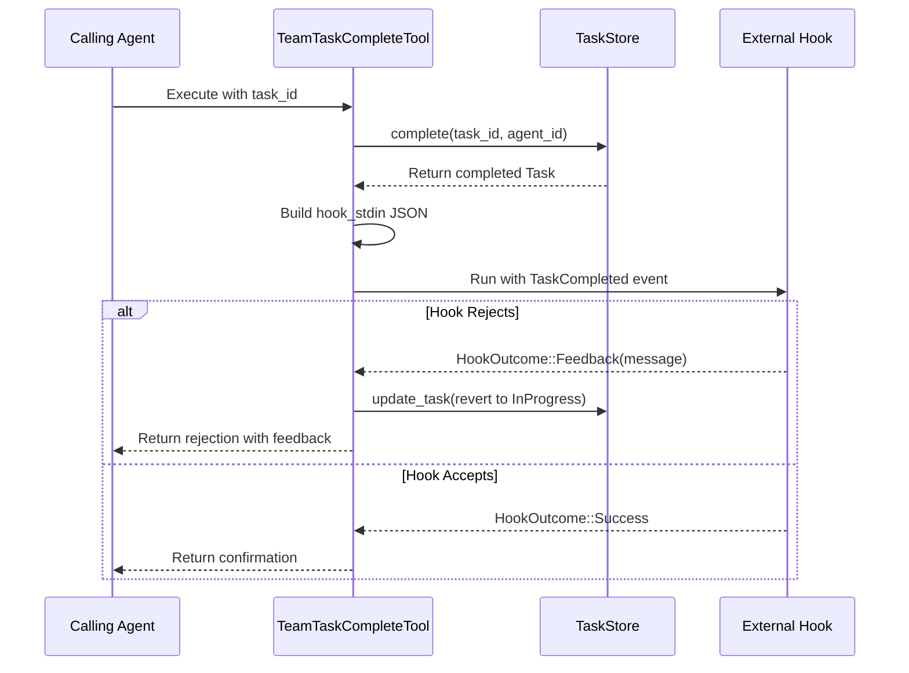

# HookEvent::TaskCompleted

**Type:** technology

### From: team_task_complete

The TaskCompleted variant of the HookEvent enum represents a critical extension point in the task lifecycle, enabling external validation and integration for task completion operations. This hook is invoked after a task has been marked complete in the store but before the operation is finalized, creating a two-phase commit pattern where extensions can veto or annotate completions. The hook receives structured JSON input on stdin containing comprehensive task metadata: team name, task identifier, title, description, completing agent, and completion timestamp in RFC 3339 format.

The hook mechanism supports sophisticated workflow orchestration scenarios that go beyond simple state management. Organizations can attach shell scripts, Python programs, or compiled binaries to the team directory that implement domain-specific validation logic. Example use cases include: verifying that required output files exist and meet size/content criteria, running automated tests against delivered artifacts, notifying external project management systems via API calls, triggering CI/CD pipeline stages, or requiring human supervisor sign-off through interactive prompts. The JSON input format enables these external programs to make context-aware decisions without needing direct access to the task store.

The `HookOutcome` type returned by `run_team_hook` determines the completion fate. A `Feedback` variant containing a message string triggers automatic rollback— the task reverts to `InProgress` status with completion timestamp cleared. This design provides clear semantics for rejection while preserving the audit trail. Successful completion (implied by non-`Feedback` outcomes) allows the operation to finalize. The hook execution is fully asynchronous, accommodating potentially long-running external validations without blocking the agent's event loop.

From a systems design perspective, this hook pattern exemplifies the Open/Closed Principle: the core completion logic remains stable while behavior can be extended without modification. The stdin-based interface maximizes interoperability—any language capable of JSON parsing and string output can implement hooks. Security considerations are delegated to the execution environment; the `run_team_hook` function likely manages process spawning with appropriate working directories and potentially sandboxed permissions. This architecture has parallels to Git hooks and Terraform plan/apply workflows, demonstrating proven patterns for extensible automation systems.

## Diagram

## External Resources

- [Git hooks reference for similar extension patterns](https://git-scm.com/book/en/v2/Customizing-Git-Git-Hooks) - Git hooks reference for similar extension patterns
- [RFC 3339 timestamp format specification](https://datatracker.ietf.org/doc/html/rfc3339) - RFC 3339 timestamp format specification
- [Open/Closed Principle in software design](https://en.wikipedia.org/wiki/Open%E2%80%93closed_principle) - Open/Closed Principle in software design

## Sources

- [team_task_complete](../sources/team-task-complete.md)
