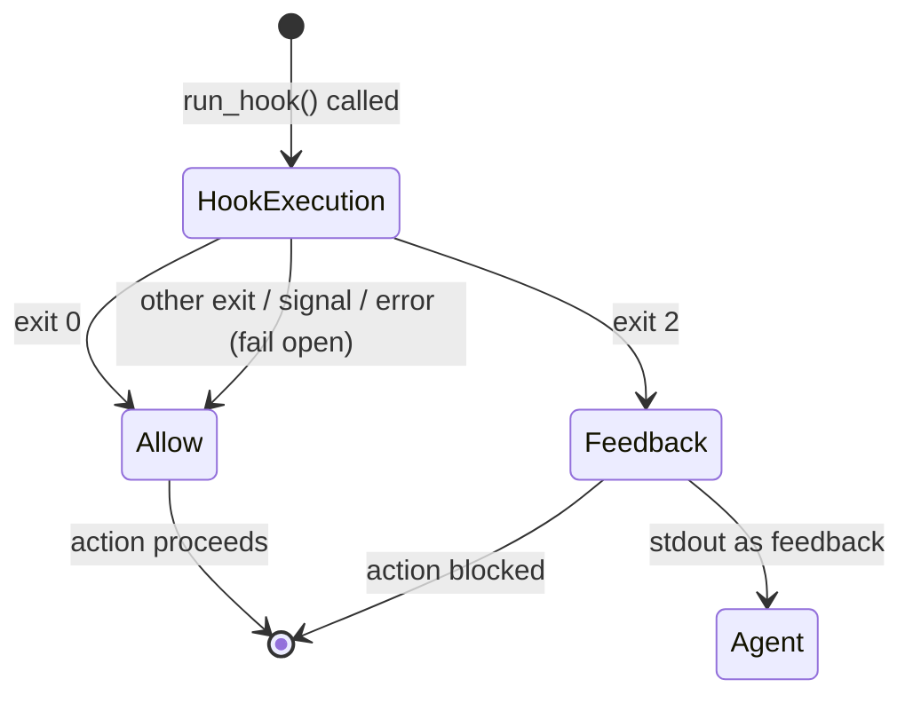

# HookOutcome

**Type:** technology

### From: manager

The `HookOutcome` enum defines the exit-code protocol for quality-gate hooks in the ragent team workflow system, establishing a structured contract between external validation scripts and the runtime engine. This enum represents the fundamental ternary decision space that hooks can express: either permit the action to proceed (`Allow`), block the action with feedback to the agent (`Feedback(String)`), or implicitly allow through unrecognized exit codes with logged warnings.

The protocol design prioritizes operational safety through the "fail open" principle: when hooks malfunction—whether through execution failures, unexpected exit codes, or signal termination—the system defaults to `HookOutcome::Allow` rather than blocking critical workflows. This decision reflects production experience where overly strict hook failure modes can deadlock agent teams or prevent recovery from transient infrastructure issues. The exit code 2 specifically is reserved for feedback-bearing rejections, with stdout captured and returned to the calling agent as structured guidance for correction.

The enum's integration spans multiple hook event types defined in `crate::team::config::HookEvent`, enabling teams to enforce policies at lifecycle transition points: task creation, task completion, plan submission, and custom extension points. The `run_hook` async function implements the protocol by executing arbitrary shell commands with configurable stdin data, capturing stdout/stderr, and mapping process exit states to enum variants. This architecture enables sophisticated governance patterns—automated security scanning, compliance checking, cost controls, or human approval gates—while maintaining the flexibility for teams to implement custom validation logic in any language via executable scripts.

## Diagram

## Sources

- [manager](../sources/manager.md)
