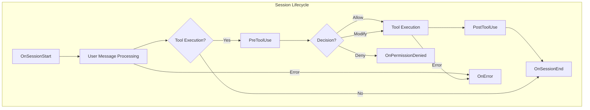

# HookTrigger

**Type:** technology

### From: mod

HookTrigger is a Rust enum that defines the complete set of lifecycle events where user-configured hooks can execute within the ragent system. This enum serves as the central taxonomy for session instrumentation, covering six distinct phases: OnSessionStart fires when a session receives its first user message, enabling initialization logging or notification workflows; OnSessionEnd fires after message processing completes, supporting cleanup or metrics collection; OnError captures LLM or tool execution failures; OnPermissionDenied handles access control rejections; PreToolUse provides synchronous interception before tool execution; and PostToolUse enables asynchronous result transformation. The enum derives essential traits including Debug, Clone, PartialEq, Eq, Serialize, and Deserialize, with serde configured to use snake_case naming for JSON compatibility. A custom Display implementation ensures consistent string representation when passing trigger names to shell environment variables, using explicit pattern matching to convert each variant to its snake_case string equivalent.

## Diagram

## External Resources

- [Serde documentation on enum serialization strategies](https://serde.rs/enum-representations.html) - Serde documentation on enum serialization strategies
- [Rust Display trait documentation for custom formatting](https://doc.rust-lang.org/std/fmt/trait.Display.html) - Rust Display trait documentation for custom formatting

## Sources

- [mod](../sources/mod.md)
