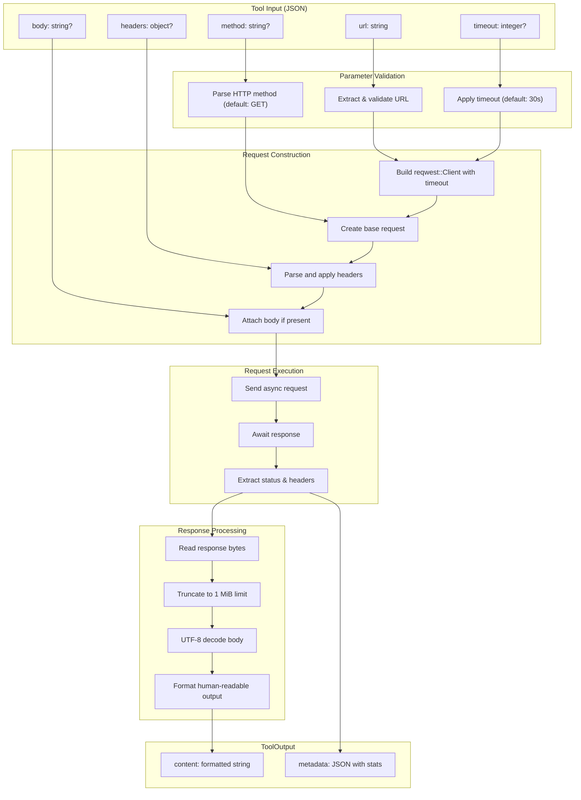

# HttpRequestTool

**Type:** technology

### From: http_request

HttpRequestTool is a Rust struct implementing the `Tool` trait, designed to perform full HTTP requests within agent-based systems. The tool provides a programmatic interface for executing HTTP operations with complete control over request construction, distinguishing it from simpler web fetching utilities. It encapsulates sophisticated HTTP client functionality including method selection, header management, body transmission, and response processing with built-in safety limits.

The tool's architecture centers on the `reqwest` HTTP client library, which provides async-first networking capabilities with modern TLS support and connection pooling. The implementation wraps this functionality in a schema-driven interface that accepts structured JSON input, making it suitable for integration with language models and other agent components that generate structured tool calls. The design emphasizes safety through response size limitations (1 MiB cap) and configurable timeouts (default 30 seconds), preventing resource exhaustion attacks or hung connections.

HttpRequestTool plays a critical role in agent systems by enabling web API interactions, data retrieval, and service integration. Its implementation demonstrates several advanced Rust patterns including trait-based polymorphism through `#[async_trait]`, builder pattern usage for client construction, and comprehensive error handling with contextual messages. The tool's permission categorization under "network:fetch" reflects security-conscious design, allowing policy engines to restrict or audit external network access. The response formatting produces human-readable output suitable for agent consumption while preserving structured metadata for programmatic downstream processing.

## Diagram

## External Resources

- [reqwest - ergonomic HTTP client for Rust with async support](https://docs.rs/reqwest/latest/reqwest/) - reqwest - ergonomic HTTP client for Rust with async support
- [Serde - framework for serializing and deserializing Rust data structures](https://serde.rs/) - Serde - framework for serializing and deserializing Rust data structures
- [anyhow - flexible error handling library for Rust applications](https://docs.rs/anyhow/latest/anyhow/) - anyhow - flexible error handling library for Rust applications

## Sources

- [http_request](../sources/http-request.md)
