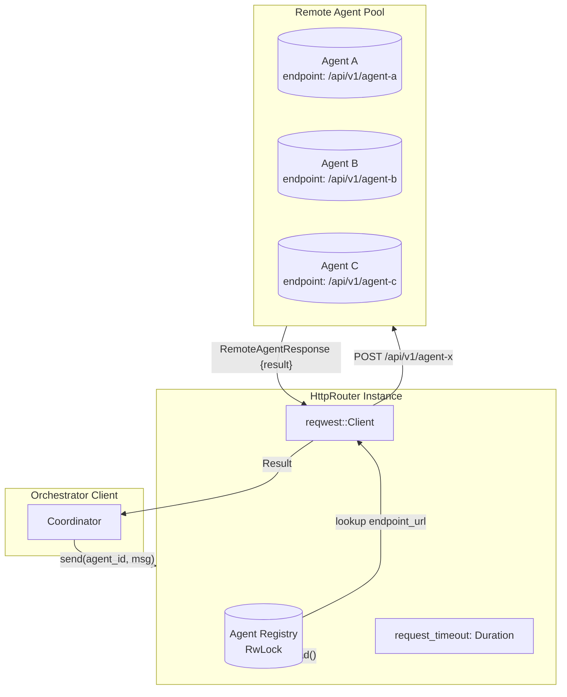

# HttpRouter

**Type:** technology

### From: transport

The `HttpRouter` struct represents a concrete implementation of the `Router` trait designed specifically for network-based agent communication. It maintains an internal registry of remote agents using thread-safe data structures, specifically `Arc<RwLock<HashMap<AgentId, RemoteAgentDescriptor>>>`, which allows concurrent read access and exclusive write access to the agent catalog. This design pattern is essential in asynchronous Rust applications where multiple tasks may simultaneously query available agents while registration and deregistration operations occur.

The router integrates with the `reqwest` HTTP client library, which provides robust handling of HTTP/HTTPS connections, connection pooling, and TLS support. Each `HttpRouter` instance carries a configurable `request_timeout` field, allowing operators to set appropriate latency bounds based on network conditions and agent responsiveness requirements. The implementation exposes lifecycle management methods including `register`, `unregister`, `list`, and `match_agents`, enabling dynamic agent discovery and capability-based routing decisions at runtime.

The core `send` implementation serializes `OrchestrationMessage` instances into `RemoteAgentRequest` structures containing job identifiers and string payloads, transmitting these via HTTP POST requests to the configured endpoint URLs. The design incorporates defensive programming with timeout handling via `tokio::time::timeout`, proper error propagation using the `anyhow` crate for context-rich error messages, and response validation checking HTTP status codes before attempting JSON deserialization. This comprehensive approach ensures reliable message delivery while providing clear diagnostics when remote agents become unavailable or misconfigured.

## Diagram

## External Resources

- [Reqwest HTTP client library documentation](https://docs.rs/reqwest/latest/reqwest/) - Reqwest HTTP client library documentation
- [Tokio shared state patterns with RwLock](https://tokio.rs/tokio/tutorial/shared-state) - Tokio shared state patterns with RwLock
- [Serde serialization framework documentation](https://serde.rs/) - Serde serialization framework documentation

## Sources

- [transport](../sources/transport.md)
