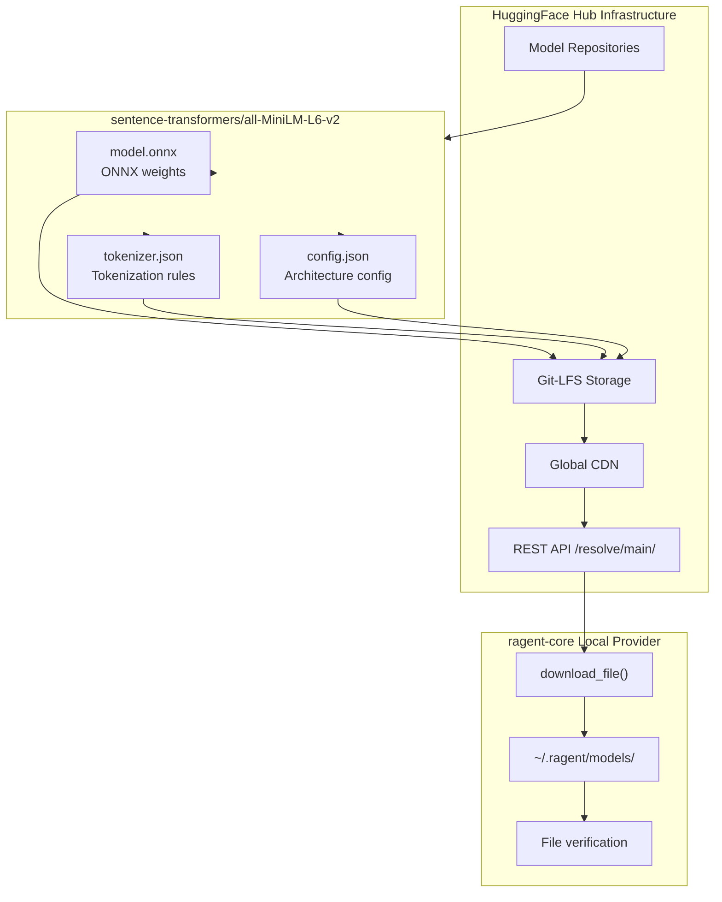

# HuggingFace

**Type:** organization

### From: local

HuggingFace, Inc. is a French-American company founded in 2016 by Clément Delangue, Julien Chaumond, and Thomas Wolf that has become the dominant platform for open-source machine learning models and tools. Originally developing a chatbot application, the company pivoted in 2019 to focus on democratizing AI through open-source contributions, most notably the Transformers library which has become the de facto standard for working with pretrained language models. The HuggingFace Hub serves as a centralized repository hosting over 500,000 models, datasets, and applications, providing version control, model cards for documentation, and inference APIs. The platform has been instrumental in the widespread adoption of transformer architectures and has raised over $160 million in venture funding, achieving unicorn status with a $2 billion valuation in 2022.

The HuggingFace ecosystem extends far beyond model hosting to encompass a comprehensive toolchain for machine learning development. The Transformers library provides unified APIs for thousands of pretrained models across modalities including text, vision, and audio. Complementary libraries like Datasets, Tokenizers, and Accelerate address specific needs in data processing, fast tokenization, and distributed training. The company's HuggingFace Hub infrastructure enables seamless model discovery and download through Git-like semantics with `git-lfs` for large file storage. For production deployment, the Inference API and HuggingFace Endpoints provide scalable serving options, while the Optimum library enables model optimization for various hardware targets including ONNX export.

In the LocalEmbeddingProvider implementation, HuggingFace serves as the distribution mechanism for the all-MiniLM-L6-v2 model files. The code constructs download URLs following the Hub's REST API pattern: `https://huggingface.co/{repo}/resolve/main/{file}`. This approach leverages HuggingFace's global CDN infrastructure for reliable, high-speed model distribution. The required files—`model.onnx` (the serialized neural network), `tokenizer.json` (tokenization vocabulary and rules), and `config.json` (model architecture configuration)—are downloaded atomically with temporary file semantics to prevent corruption from interrupted transfers. The implementation's dependency on HuggingFace reflects the platform's role as critical infrastructure in the modern AI ecosystem, where open model weights and standardized formats enable local, private, and cost-effective AI deployment patterns that compete with proprietary API services.

## Diagram

## External Resources

- [HuggingFace Hub homepage and model repository](https://huggingface.co/) - HuggingFace Hub homepage and model repository
- [Transformers library source code and documentation](https://github.com/huggingface/transformers) - Transformers library source code and documentation
- [HuggingFace Hub API documentation for programmatic downloads](https://huggingface.co/docs/hub/api) - HuggingFace Hub API documentation for programmatic downloads

## Sources

- [local](../sources/local.md)
