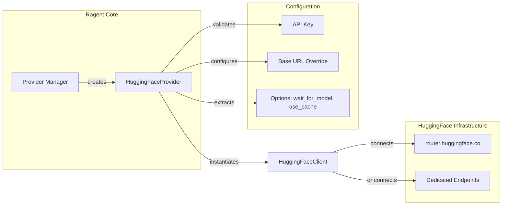

# HuggingFaceProvider

**Type:** technology

### From: huggingface

HuggingFaceProvider is the main provider struct that implements ragent's Provider trait for integrating with the HuggingFace Inference API. This struct serves as the entry point for all HuggingFace-specific configuration and client creation within the ragent system. The provider identifies itself with the ID "huggingface" and the display name "Hugging Face", following ragent's provider naming conventions. It exposes four key capabilities through the Provider trait: identification via id() and name(), default model catalog provision through default_models(), and client instantiation via create_client().

The provider's design accommodates both the free/Pro shared Inference API and dedicated Inference Endpoints through flexible configuration. When creating a client, it accepts an optional base_url override for custom endpoints while defaulting to HF_API_BASE (https://router.huggingface.co). The create_client method validates that an API key is provided—HuggingFace requires authentication via HF_TOKEN for all API access. It also extracts provider-specific options including wait_for_model (defaulting to true, which waits for cold-start model loading) and use_cache (defaulting to true, enabling HuggingFace's response caching). These options are passed through HTTP headers in subsequent requests.

The implementation reflects the architectural pattern used throughout ragent-core where providers act as factories for their corresponding clients. This separation allows the provider to focus on configuration and validation while delegating actual API communication to HuggingFaceClient. The provider's curated default model catalog, accessed via huggingface_default_models(), serves as a fallback when dynamic model discovery is unavailable or disabled, ensuring users always have functional model options even without Hub API access.

## Diagram

## External Resources

- [HuggingFace Inference API documentation](https://huggingface.co/docs/api-inference/index) - HuggingFace Inference API documentation
- [HuggingFace Inference Endpoints for dedicated deployment](https://huggingface.co/blog/inference-endpoints) - HuggingFace Inference Endpoints for dedicated deployment

## Sources

- [huggingface](../sources/huggingface.md)
